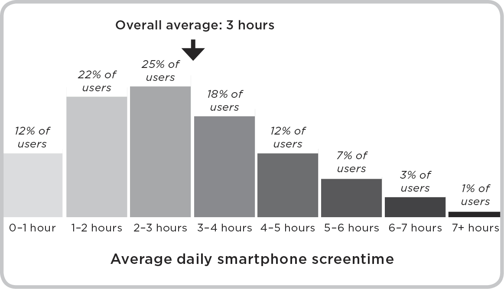
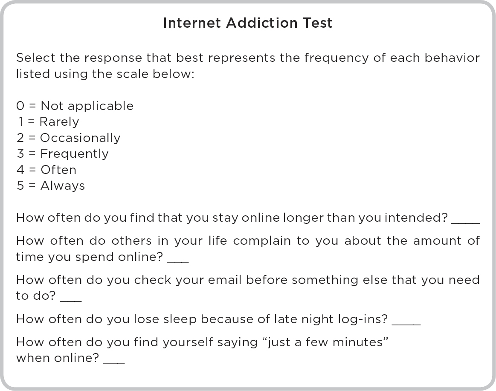

# 1. The Rise of Behavioral Addiction

## 1.

## The Rise of Behavioral Addiction

A couple of years ago, Kevin Holesh, an app developer, decided that he wasn’t spending enough time with his family. The culprit was technology, and his smartphone was the biggest offender. Holesh wanted to know how much time he was spending on his phone each day, so he designed an app called Moment. Moment tracked Holesh’s daily screen time, tallying how long he used his phone each day. I spent months trying to reach Holesh because he lives by his word. On the Moment website, he writes that he may be slow to reply to email because he’s trying to spend less time online. Eventually, after my third attempt, Holesh replied with a polite apology and agreed to talk. “The app stops tracking when you’re just listening to music or making phone calls,” Holesh told me. “It starts up again when you’re looking at your screen—sending emails or browsing the web, for example.” Holesh was spending an hour and fifteen minutes a day glued to his screen, which seemed like a lot. Some of his friends had similar concerns, but also had no idea how much time they lost to their phones. So Holesh shared the app. “I asked people to guess what their daily usage was and they were almost always 50 percent too low.”

I downloaded Moment several months ago. I guessed I was using my phone for an hour a day at the most, and picking it up perhaps ten times a day. I wasn’t proud of those numbers, but they sounded about right. After a month, Moment reported that I was using my phone for an average of three hours a day, and picking it up an average of forty times. I was stunned. I wasn’t playing games or surfing the web for hours, but somehow I managed to spend twenty hours a week staring at my phone.

I asked Holesh whether my numbers were typical. “Absolutely,” he said. “We have thousands of users, and their average usage time is just under three hours. They pick up their phones an average of thirty-nine times a day.” Holesh reminded me that these were the people who were concerned enough about their screen time to download a tracking app in the first place. There are millions of smartphone users who are oblivious or just don’t care enough to track their usage—and there’s a reasonable chance they’re spending even more than three hours on their phones each day.

Perhaps there was just a small clump of heavy users who spent all day, every day on their phones, dragging the average usage times higher. But Holesh shared the usage data of eight thousand Moment users to illustrate that wasn’t the case at all:

Most people spend between one and four hours on their phones each day—and many far longer. This isn’t a minority issue. If, as guidelines suggest, we should spend less than an hour on our phones each day, 88 percent of Holesh’s users were overusing. They were spending an average of a quarter of their waking lives on their phones—more time than any other daily activity, except sleeping. Each month almost one hundred hours was lost to checking email, texting, playing games, surfing the web, reading articles, checking bank balances, and so on. Over the average lifetime, that amounts to a staggering *eleven years*. On average they were also picking up their phones about three times an hour. This sort of overuse is so prevalent that researchers have coined the term “nomophobia” to describe the fear of being without mobile phone contact (an abbreviation of “no-mobile-phobia”).

Smartphones rob us of time, but even their mere presence is damaging. In 2013, two psychologists invited pairs of strangers into a small room and asked them to engage in conversation. To smooth the process, the psychologists suggested a topic: why not discuss an interesting event that happened to you over the past month? Some of the pairs talked while a smartphone sat idle nearby, while for others the phone was replaced by a paper notebook. Every pair bonded to some extent, but those who grew acquainted in the presence of the smartphone struggled to connect. They described the relationships that formed as lower in quality, and their partners as less empathetic and trustworthy. Phones are disruptive by their mere existence, even when they aren’t in active use. They’re distracting because they remind us of the world beyond the immediate conversation, and the only solution, the researchers wrote, is to remove them completely.

Smartphones aren’t the only culprits. Bennett Foddy has played thousands of video games, but refuses to play World of Warcraft*.* Foddy is a brilliant thinker with dozens of interests. He works as a game developer and professor at New York University’s Game Center. Foddy was born and lived in Australia, where he was the bassist in an Australian band called Cut Copy—which released several best-selling singles and won a string of Australian music awards—until he moved, first to Princeton University and then to Oxford University, to study philosophy. Foddy has immense respect for WoW, as it’s known, but won’t play it himself. “I take it as part of my job to play all the culturally significant games. But I didn’t play that one because I can’t afford the loss of time. I know myself reasonably well, and I suspect it probably would have been difficult for me to shake.”

WoW may be one of the most addictive behavioral experiences on the planet. It’s a massively multiplayer online role-playing game, with millions of players from around the world who create avatars that roam across landscapes, fight monsters, complete quests, and interact with other players. Almost half of all players consider themselves “addicted.” An article in *Popular Science* described WoW as “the obvious choice” when searching for the world’s most addictive game. There are support groups with thousands of members, and more than a quarter of a million people have taken the free online World of Warcraft Addiction Test. In ten years, the game has grossed more than ten billion dollars, and attracted more than one hundred million subscribers. If they formed a nation, it would be the twelfth biggest on Earth. WoW players choose an avatar, which represents them as they complete quests in a virtual world called Azeroth. Many players band together to form guilds—teams of allied avatars—which is part of what makes the game so addictive. It’s hard to sleep at night when you know three of your guild-mates in Copenhagen, Tokyo, and Mumbai are on an epic quest without you. As we chatted, I was struck by Foddy’s passion for games. He believes without a doubt that they’re a net force for good in the world—but still refuses to sample the charms of Azeroth for fear of losing months or years of his life.

Games like WoW attract millions of teens and young adults, and a considerable minority—up to 40 percent—develop addictions. Several years ago a computer programmer and a clinical psychologist joined forces to open a gaming and Internet addiction center in the woods near Seattle. The center, named reSTART, houses a dozen or so young men who are addicted to WoW, or one of a handful of other games. (reSTART tried admitting a small group of women, but many Internet addicts also develop sex addictions, so cohabitation became a major distraction.) Computers have never before had the memory to run games like WoW, which are much faster, more immersive, and less clunky than the games of the twentieth century. They allow you to interact with other people in real time, a huge part of what makes them so addictive.

Technology has also changed how we exercise. Fifteen years ago I bought an early model Garmin exercise watch, a mammoth rectangular device somewhere between a watch and a wrist weight. It was so heavy that I had to carry a water bottle in my other hand to balance its weight. It lost its GPS signal every couple of minutes, and battery life was so limited that it was useless on long runs. Today there are cheaper, smaller wearable devices that capture every step. That’s miraculous, but also a recipe for obsession. Exercise addiction has become a psychiatric specialty because athletes are constantly reminded of their activity and, even more so, their inactivity. People who wear exercise watches become trapped in a cycle of escalation. Ten thousand steps may have been the gold standard last week, but this week it’s eleven thousand. Next week, twelve thousand, and then fourteen thousand. That trend can’t continue forever, but many people push through stress fractures and other major injuries to seek the same endorphin high that came from a much lighter exercise load only months earlier.

Intrusive tech has also made shopping, work, and porn harder to escape. It was once almost impossible to shop and work between the late evening and early morning, but now you can shop online and connect to your workplace any time of the day. Gone also are the days of stealing a copy of *Playboy* from the newsstand; all you need are Wi-Fi and a web browser. Life is more convenient than ever, but convenience has also weaponized temptation.

So how did we get here?

—

The first “behavioral addicts” were two-month-old babies. In early December 1968, forty-one psychologists who studied human vision met in New York City at the annual meeting of the Association for Research in Nervous and Mental Disease to discuss why our ability to see sometimes fails. It was a who’s who of academic luminaries. Roger Sperry would win the Nobel Prize in medicine thirteen years later. Neuroscientist Wilder Penfield was once described as the “greatest living Canadian,” and Stanford’s William Dement was crowned “the father of sleep medicine.”

In attendance was the psychologist Jerome Kagan, who a decade earlier had joined Harvard University to create the first program in human development. By his retirement half a century later, he was listed as the twenty-second most eminent psychologist of all time—ahead of giants like Carl Jung, Ivan Pavlov, and Noam Chomsky.

At the meeting, Kagan discussed visual attention in infants. How, he asked, do two-month-old babies know what to look at and what to ignore? Their growing brains are bombarded by a kaleidoscope of visual information, and yet somehow they learn to focus on some images and look past others. Kagan noticed that very young babies were drawn to moving, hard-edged objects. In fact, they couldn’t look away when a researcher dangled a wooden block before them. According to Kagan, these infants were showing “a behavioral addiction to contour and movement.”

By modern standards, though, it would be a stretch to call the infants behavioral addicts. Kagan was right that they couldn’t look away, but the way we think of behavioral addiction today is quite different. It’s more than an instinct that we can’t override, because that would include blinking and breathing. (Try holding your breath till you pass out and your brain will eventually force you to breathe again. The fact that we can’t help inhaling and exhaling means we’re unlikely to die from forgetting to breathe.) Modern definitions recognize that addiction is ultimately a bad thing. A behavior is addictive only if the rewards it brings now are eventually outweighed by damaging consequences. Breathing and looking at wooden blocks aren’t addictive because, even if they’re very hard to resist, they aren’t harmful. Addiction is a deep attachment to an experience that is harmful and difficult to do without. Behavioral addictions don’t involve eating, drinking, injecting, or smoking substances. They arise when a person can’t resist a behavior, which, despite addressing a deep psychological need in the short-term, produces significant harm in the long-term.

*Obsession* and *compulsion* are close relatives of behavioral addiction. Obsessions are thoughts that a person can’t stop having, and compulsions are behaviors a person can’t stop enacting. There’s a key difference between addictions, and obsessions and compulsions. Addictions bring the promise of immediate reward, or positive reinforcement. In contrast, obsessions and compulsions are intensely unpleasant to *not* pursue. They promise relief—also known as negative reinforcement—but not the appealing rewards of a consummated addiction. (Since they’re so closely related, I’ll use all three terms in this book.)

Behavioral addiction also has a third relative in obsessive passion. In 2003, seven Canadian psychologists, led by the researcher Robert Vallerand, wrote a paper splitting the concept of passion in two. “Passion,” they said, “is defined as a strong inclination toward an activity that people like, that they find important, and in which they invest time and energy.” Harmonious passions are very healthy activities that people choose to do without strings attached—the model train set that an elderly man has been working on since his youth, or the series of abstract paintings that a middle-aged woman creates in her free time. “Individuals are not compelled to do the activity,” the researchers said, “but rather they freely choose to do so. With this type of passion, the activity occupies a significant but not overwhelming space in the person’s identity and is in harmony with other aspects of the person’s life.”

Obsessive passions, however, are unhealthy and sometimes dangerous. Driven by a need that goes beyond simple enjoyment, they’re likely to produce behavioral addictions. As the researchers defined it, the individual “cannot help but to engage in the passionate activity. The passion must run its course as it controls the person. Because activity engagement is out of the person’s control, it eventually takes disproportionate space in the person’s identity and causes conflict with other activities in the person’s life.” This is the video game that a teenager plays all night instead of sleeping and doing his homework. Or the runner who once ran for fun, but now feels compelled to run at least six miles a day at a certain pace, even as debilitating stress injuries set in. Until she’s on her back, unable to walk, she’ll continue to run daily because her identity and well-being are intimately bound with her as yet unbroken streak. Harmonious passions “make life worth living,” but an obsessive passion plagues the mind.

—

There are people, of course, who disagree with the idea that addictions can be purely behavioral. “Where are the substances?” they ask. “If you can be addicted to video games and smartphones, why can’t you be addicted to smelling flowers or walking backward?” You *can* be addicted to those things, in theory. If they come to fulfill a deep need, you can’t do without them, and you begin to pursue them while neglecting other aspects of your life, then you’ve developed a behavioral addiction to smelling flowers or walking backward. There probably aren’t many people with those particular addictions, but they aren’t inconceivable. Meanwhile, there are many, *many* people who show similar symptoms when you introduce them to a smartphone or a compelling video game or the concept of email.

There are also people who say that the term “addiction” can’t possibly apply to a majority of the population. “Doesn’t that devalue the term ‘addiction’? Doesn’t that make it meaningless and empty?” they ask. When, in 1918, a flu pandemic killed seventy-five million people, no one suggested that a flu diagnosis was meaningless. The issue demanded attention precisely because it affected so many people, and the same is true of behavioral addiction. Smartphones and email are hard to resist—because they’re both part of the fabric of society and promote psychologically compelling experiences—and there will be other addictive experiences in the coming decades. We shouldn’t use a watered-down term to describe them; we should acknowledge how serious they are, how much harm they’re doing to our collective well-being, and how much attention they deserve. The evidence so far is concerning, and trends suggest we’re wading deeper into dangerous waters.

Still, it’s important to use the term “behavioral addiction” carefully. A label can encourage people to see a disorder everywhere. Shy kids were suddenly labeled “Asperger’s sufferers” when the term became popular; people with volatile emotions were similarly labeled “bipolar.” Allen Frances, a psychiatrist and expert on addiction, is concerned about the term “behavioral addiction.” “If 35 percent of people suffer from a disorder, then it’s just a part of human nature,” he says. “Medicalizing behavioral addiction is a mistake. What we should be doing is what they do in Taiwan and Korea. There they see behavioral addiction as a social issue rather than a medical issue.” I agree. Not everyone who uses a smartphone for more than ninety minutes a day should be in treatment. But what is it about smartphones that makes them so compelling? Should we introduce structural checks and balances on the growing role they play in our collective lives? A symptom affecting so many people is no less real or more acceptable simply because it becomes a new norm; we need to understand that symptom to decide whether and how to deal with it.

—

Just how common are behavioral addictions? The most debilitating addictions, which hospitalize people or render them incapable of living vaguely normal lives, are quite rare, affecting just a few percent of the population. But moderate behavioral addictions are far more common. These addictions make our lives less worthwhile, make us less effective at work and play, and diminish our interactions with other people. They inflict milder psychological traumas than severe addictions, but even milder traumas accumulate over time to degrade a person’s well-being.

Figuring out how many people suffer from behavioral addictions is difficult, because most of these addictions go unreported. Dozens of studies have investigated the question, but the most comprehensive came from an English psychology professor named Mark Griffiths, who has been studying behavioral addiction for more than twenty years. He speaks as quickly and passionately as you’d expect from someone who has published more than five hundred papers midway through his career. A precocious student, Griffiths finished his doctorate at twenty-three—a couple of years before the Internet boom. “It was 1994,” Griffiths says, “I was presenting a paper at an annual British Psychological Society meeting on technology and addiction, and there was a press conference after the talk. At that point people were talking about slot machine, video game, and TV addictions, and someone asked whether I’d heard about this new thing called the Internet, and whether it could lead to new types of addictions.” At first Griffiths wasn’t sure what to make of the Internet, but he was fascinated by the idea that it might be a route to addiction. He applied for government funding and began to study the topic.

Reporters often asked Griffiths how common behavioral addictions were, but he struggled to give them a definitive answer. The data just weren’t available. So he joined forces with two researchers at the University of Southern California to find out. They published a long and thorough review paper in 2011, surveying dozens of studies, each carefully vetted before its inclusion. Studies were only included if they had at least five hundred respondents, both men and women, aged between sixteen and sixty-five years, and their measurement methods had to be reliable and supported with careful research. The result was an impressive eighty-three studies with a grand total of 1.5 million respondents from four continents. The studies focused on gambling, love, sex, shopping, Internet, exercise, and work addictions, as well as alcohol, nicotine, narcotic, and other substance addictions.

The bottom line: a staggering 41 percent of the population has suffered from at least one behavioral addiction over the past twelve months. These aren’t trivial disorders; Griffiths and his colleagues were saying that almost half of the population had experienced the following symptoms:

[The] loss of ability to choose freely whether to stop or continue the behavior (loss of control) and [the] experience of behavior-related adverse consequences. In other words, the person becomes unable to reliably predict when the behavior will occur, how long it will go on, when it will stop, or what other behaviors may become associated with the addictive behavior. As a consequence, other activities are given up or, if continued, are no longer experienced as being as enjoyable as they once were. Further negative consequences of the addictive behavior may include interference with performance of life roles (e.g., job, social activities, or hobbies), impairment of social relationships, criminal activity and legal problems, involvement in dangerous situations, physical injury and impairment, financial loss, or emotional trauma.

Some of these addictions continue to grow with technological innovation and social change. One recent study suggested that up to 40 percent of the population suffers from some form of Internet-based addiction, whether to email, gaming, or porn. Another found that 48 percent of its sample of U.S. university students were “Internet addicts,” and another 40 percent were borderline or potential addicts. When asked to discuss their interactions with the Internet, most of the students gravitated toward negative consequences, explaining that their work, relationship, and family lives were poorer because they spent too much time online.

At this point, you may be wondering whether you or someone you love is technically “addicted to the Internet.” This is a sample of five questions from the twenty-item Internet Addiction Test, a widely used measure of Internet addiction. Take a moment to answer each question using the scale below, from 0 to 5:

If you scored 7 or below, you show no signs of Internet addiction. A score of 8–12 suggests mild Internet addiction—you may spend too long on the web sometimes, but you’re generally in control of your usage. A score of 13–20 indicates moderate Internet addiction, which implies that your relationship with the Internet is causing you “occasional or frequent problems.” A score between 21 and 25 suggests severe Internet addiction, and implies that the Internet is causing “significant problems in your life.” (I’ll return to the question of how to deal with a high score in the third section of this book.)

Beyond Internet addiction, 46 percent of people say they couldn’t bear to live without their smartphones (some would rather suffer physical injury than an injury to their phones), and 80 percent of teens check their phones at least once an hour. In 2008, adults spent an average of eighteen minutes on their phones per day; in 2015, they were spending two hours and forty-eight minutes per day. This shift to mobile devices is dangerous, because a device that travels with you is always a better vehicle for addiction. In one study, 60 percent of respondents reported binge-watching dozens of television episodes in a row despite planning to stop much sooner. Up to 59 percent of people say they’re dependent on social media sites and that their reliance on these sites ultimately makes them unhappy. Of that group, half say they need to check those sites at least once an hour. After an hour, they are anxious, agitated, and incapable of concentrating. Meanwhile, in 2015, there were 280 million smartphone addicts. If they banded together to form the “United States of Nomophobia,” it would be the fourth most populous country in the world, after China, India, and the United States.

In 2000, Microsoft Canada reported that the average human had an attention span of twelve seconds; by 2013 that number had fallen to eight seconds. (According to Microsoft, a goldfish, by comparison, has an average attention span of nine seconds.) “Human attention is dwindling,” the report declared. Seventy-seven percent of eighteen- to twenty-four-year-olds claimed that they reached for their phones before doing anything else when nothing is happening. Eighty-seven percent said they often zoned out, watching TV episodes back-to-back. More worrying, still, Microsoft asked two thousand young adults to focus their attention on a string of numbers and letters that appeared on a computer screen. Those who spent less time on social media were far better at the task.

—

Addiction originally meant a different kind of strong connection: in ancient Rome, being addicted meant you had just been sentenced to slavery. If you owed someone money and couldn’t repay the debt, a judge would sentence you to addiction. You’d be forced to work as a slave until you’d repaid your debt. This was the first use of the word *addiction*, but it evolved to describe any bond that was difficult to break. If you liked to drink wine, you were a wine addict; if you liked to read books, you were a book addict. There was nothing fundamentally wrong with being an addict; many addicts were just people who *really* liked eating or drinking or playing cards or reading. To be an addict was to be passionate about something, and the word *addiction* became diluted over the centuries.

In the 1800s, the medical profession breathed new life into the word. In particular, doctors paid special attention in the late 1800s when chemists learned to synthesize cocaine, because it became more and more difficult to wean users off the drug. At first cocaine seemed like a miracle, allowing the elderly to walk for miles and the exhausted to think clearly again. In the end, though, most users became addicted, and many failed to survive.

I’ll return to behavioral addiction shortly, but to understand its rise I’ll need to focus on substance addiction first. The word “addiction” has only implied substance abuse for two centuries, but hominids have been addicted to substances for thousands of years. DNA evidence suggests that Neanderthals carried a gene known as DRD4-7R as long as forty thousand years ago. DRD4-7R is responsible for a constellation of behaviors that set Neanderthals apart from earlier hominids, including risk-taking, novelty-seeking, and sensation-seeking. Where pre-Neanderthal hominids were timid and risk-averse, Neanderthals were constantly exploring and rarely satisfied. A variant of DRD4-7R known as DRD4-4R is still present in about 10 percent of the population, who are far more likely than others to be daredevils and serial addicts.

It’s impossible to pinpoint the first human addict, but records suggest he or she lived more than thirteen thousand years ago. The world was a very different place then. Neanderthals were long extinct, but the Earth was still covered in glaciers, the woolly mammoth would exist for another two thousand years, and humans were just beginning to domesticate sheep, pigs, goats, and cows. Farming and agriculture would only begin several millennia later, but on the Southeast Asian island of Timor, someone stumbled onto the betel nut.

The betel nut is the ancient, unrefined cousin of the modern cigarette. Betel nuts contain an odorless oily liquid known as arecoline, which acts much like nicotine. When you chew a betel nut, your blood vessels dilate, you breathe more easily, your blood pumps faster, and your mood lightens. People often claim to think more clearly after chewing a betel nut, and it’s still a popular drug of choice in parts of South and Southeast Asia.

Betel nuts, however, have a nasty side effect. If you chew them often enough, your teeth will become black and rotten and they may fall out. Despite the obvious cosmetic costs of chewing the nuts, plenty of users continue chewing even as they lose their teeth. When Chinese emperor Zhou Zhengwang visited Vietnam two thousand years ago, he asked his hosts why their teeth were black. They explained that “betel-chewing is for keeping good sanitary conditions in the mouth; therefore, teeth turn black.” This is shaky logic, at best. When parts of you turn pitch black, you need an open mind to conclude that the transformation is healthy.

South Asians weren’t the only ancient addicts. Other civilizations delved into whatever grew locally. For thousands of years, residents of the Arabian Peninsula and the Horn of Africa have been chewing the khat leaf, a stimulant that acts like the drug speed, or methamphetamine. Khat users become talkative, euphoric, and hyperactive, and their heart rates rise as though they’ve had several cups of strong coffee. Around the same time, Aboriginal Australians stumbled upon the pituri plant, while their contemporaries in North America discovered the tobacco plant. Both plants can be smoked or chewed, and both contain heavy doses of nicotine. Meanwhile, seven thousand years ago, South Americans in the Andes began chewing the leaves of the coca plant at large communal gatherings. A hemisphere away, the Samarians were learning to prepare opium, which pleased them so much that they etched instructions on small clay tablets.

—

Substance addiction, as we know it, is relatively new, because it relies on sophisticated chemistry and expensive equipment. In television’s *Breaking Bad*, chemistry-teacher-turned-meth-cook Walter White is obsessed with the purity of his product. He produces “Blue Sky,” which is 99.1 percent pure, and earns immense global respect (and millions of dollars in drug money). But, in reality, meth addicts will buy anything they can find, so meth dealers cut the raw product with fillers that dilute its purity. Regardless of the emphasis on purity, the process of manufacturing the drug is intricate and technical. The same is true of many other drugs, which are chemically quite different from the raw plants that contain their primary ingredients.

Before drugs were big business, doctors and chemists discovered their effects by trial and error, or by accident. In 1875 the British Medical Association elected seventy-eight-year-old Sir Robert Christison as its forty-fourth president. Christison was tall, severe, and eccentric. He had begun practicing medicine fifty years earlier, just as homicidal Englishmen were learning to poison each other with arsenic, strychnine, and cyanide. Christison wondered how these and other toxins affected the human body. Volunteers were hard to come by, so he spent decades swallowing and regurgitating dangerous poisons himself, documenting their effects in real time just before he lost consciousness.

One of those toxins was a small green leaf, which numbed Christison’s mouth, gave him a burst of long-lasting energy, and left him feeling decades younger than his eighty years. Christison was so invigorated that he decided to set out for a long walk. Nine hours and fifteen miles later he returned home and wrote that he was neither hungry nor thirsty. The next morning, he awoke feeling fit and ready to tackle the new day. Christison had been chewing on the coca leaf, the plant responsible for its famous stimulant cousin, cocaine.

In Vienna, one thousand miles to the southeast, a young neurologist was also experimenting with cocaine. Many people remember Sigmund Freud for his theories of human personality, sexuality, and dreaming, but he was also famous in his day for promoting cocaine. Chemists had first synthesized the drug three decades earlier, and Freud read of Christison’s miraculous fifteen-mile stroll with interest. Freud found that cocaine not only gave him energy, but also calmed his recurring bouts of depression and indigestion. In one of more than nine hundred letters to his fiancée, Martha Bernays, Freud wrote:

If it goes well I will write an essay on [cocaine] and I expect it will win its place in therapeutics by the side of morphium and superior to it . . . I take very small doses of it regularly against depression and against indigestion, and with the most brilliant success.

Freud’s life was filled with highs and lows, but the decade that followed this letter to Martha was particularly turbulent. It began with a high point: the publication of his essay titled “Über Coca” in 1884. In Freud’s words, “Über Coca” was “a song of praise to this magical substance.” Freud played every part in the “Über Coca” drama; he was experimenter, research subject, and animated writer.

A few minutes after taking cocaine, one experiences a sudden exhilaration and feeling of lightness. One feels a certain furriness on the lips and palate, followed by a feeling of warmth in the same areas . . . The psychic effect of [cocaine] . . . consists of exhilaration and lasting euphoria, which does not differ in any way from the normal euphoria of a healthy person.

“Über Coca” also hints at cocaine’s darker side, though Freud seemed more fascinated than concerned:

During this first trial I experienced a short period of toxic effects . . . Breathing became slower and deeper and I felt tired and sleepy; I yawned frequently and felt somewhat dull . . . If one works intensively while under the influence of coca, after from three to five hours there is a decline in the feeling of well-being, and a further dose of coca is necessary in order to ward off fatigue.

Many psychologists have criticized Freud because his most famous theories are impossible to test (are men who dream of caves really preoccupied with the womb?), but he championed careful experimentation with cocaine. As his letters show, Freud discovered that cocaine, like any addictive stimulus, wore off and its effects weakened over time. The only way to recreate the original high was with repeated, escalating doses. He took at least a dozen large doses, and ultimately became addicted. He struggled to think and work without the drug, and became convinced his best ideas flowered under its influence. In 1895, his nose became infected and he endured operations to repair his collapsed nostrils. In one letter to his friend and ear, nose, and throat specialist, Wilhelm Fliess, Freud described in graphic detail the effects of cocaine. Ironically, the only thing that soothed his nose was another dose of cocaine. When the pain was particularly bad, he painted his nostrils with a solution of water and cocaine. A year later, dejected, he concluded that cocaine was more harmful than helpful. In 1896, twelve years after first encountering cocaine, Freud was forced to stop using the drug completely.

How could Freud see cocaine’s upside but not its staggering downside? Early in his infatuation with the drug, he decided it was the answer to morphine addiction. He described the case of a patient who quit morphine cold turkey and went into “sudden withdrawal,” wracked by chills and bouts of depression. But when the man began ingesting cocaine, he recovered completely, functioning normally with the help of a heavy daily dose of cocaine. Freud’s biggest mistake was to believe that this effect was permanent:

After ten days he was able to dispense with the coca treatment altogether. The treatment of morphine addiction with coca does not, therefore, result merely in the exchange of one kind of addiction for another . . . the use of coca is only temporary.

Freud was seduced by cocaine in part because he lived during a time when addiction was presumed to affect people who were weak of mind and body. Genius and addiction were incompatible, and he (like Robert Christison) discovered cocaine at the height of his intellectual powers. Freud so deeply misunderstood the drug that he believed it could replace and eliminate morphine addiction. He wasn’t the only person to hold this belief. Two decades before Freud wrote “Über Coca,” a Confederate Army colonel became addicted to morphine after he was injured during the final battle of the American Civil War. He, too, believed he could overcome his morphine addiction with a cocaine-laced tincture. He was wrong, but his medicine ultimately became one of the most widely consumed substances on Earth.

—

The Civil War ended with a brief but bloody battle on the evening of Easter, April 16, 1865. The Union and Confederate armies converged on the Chattahoochee River, near Columbus, Georgia, and fought on horseback near two bridges that spanned the river. One unfortunate Confederate soldier, John Pemberton, encountered a wall of Union cavalrymen when he tried to block a bridge that led into the heart of Columbus. Pemberton brandished a saber, but before he could use it he was shot. As he reared back in agony, a Union soldier inflicted a deep slash across Pemberton’s chest and stomach. He slumped down, near death, but was dragged to safety by a friend.

Pemberton survived, but his saber wound burned for months. Like thousands of other injured soldiers, he treated his pain with morphine. At first, army doctors administered small doses spread many hours apart, but Pemberton began to tolerate the drug. He demanded bigger doses more and more often, and eventually developed a full-blown addiction. The doctors did their best to wean him off the drug, but they were undermined at every step—Pemberton had been a chemist before the war, so his old suppliers stepped in when the army’s contribution dwindled. His friends became concerned, and Pemberton was ultimately forced to acknowledge that morphine was doing his body more harm than good.

Like any good scientist—and like Freud after him—Pemberton experimented. His goal was a non-addictive replacement for morphine to relieve chronic pain. By the 1880s, after several false starts, Pemberton found a winner in Pemberton’s French Wine Coca: a combination of wine, coca leaves, kola nuts, and an aromatic shrub called damiana. There was no Food and Drug Administration in the 1880s, so Pemberton was free to wax lyrical (and ungrammatical) about the tonic’s medical properties, even if he wasn’t quite sure how it worked. He paid for one newspaper ad in 1885, which read:

French Wine Coca is indorsed by over 20,000 of the most learned and scientific medical men in the world . . .

. . . Americans are the most nervous people in the world . . . All who are suffering from any nervous complaints we commend to use the wonderful and delightful remedy, French Wine Coca, infallible in curing all who are afflicted with any nerve trouble, dyspepsia, mental and physical exhaustion, all chronic wasting diseases, gastric irritability, constipation, sick headache, neuralgia, etc. is quickly cured by the Coca Wine . . .

. . . Coca is a most wonderful invigorator of the sexual organs and will cure seminal weakness, impotency, etc., when all other remedies fail . . .

To the unfortunate who are addicted to the morphine or opiate habit, or the excessive use of alcohol stimulants, the French Wine Coca has proven a great blessing, and thousands proclaim it the most remarkable invigorator that every sustained a wasting and sinking system.

Like Sigmund Freud, Pemberton believed that a combination of caffeine and coca leaves would conquer his morphine addiction without introducing a new one in its place. When the local government introduced prohibition laws in 1886, Pemberton removed the wine from his medicine, rechristening it Coca-Cola.

The story splits in two here. For the product, Coca-Cola, the sky was the limit. Coca-Cola went from strength to strength, sold first to business tycoon Asa Candler, and then to marketing geniuses Ernest Woodruff and W. C. Bradley. Woodruff and Bradley devised the brilliant idea of selling Coke in six-packs, to be carried more easily between the store and home, and both became immeasurably rich. For the man, John Pemberton, the opposite was true. Coca-Cola turned out not to be a viable replacement for morphine, and his addiction deepened. Instead of replacing morphine, cocaine compounded the problem, Pemberton’s health continued to decline, and in 1888, he died penniless.

It’s easy to look back at how little Freud and Pemberton understood of cocaine with a sense of superiority. We teach our children that cocaine is dangerous, and it’s hard to believe that experts considered the drug a panacea only a century ago. But perhaps our sense of superiority is misplaced. Just as cocaine charmed Freud and Pemberton, today we’re enamored of technology. We’re willing to overlook its costs for its many gleaming benefits: for on-demand entertainment portals, car services, and cleaning companies; Facebook and Twitter; Instagram and Snapchat; Reddit and Imgur; Buzzfeed and Mashable; Gawker and Gizmodo; online gambling sites, Internet video platforms, and streaming music hubs; hundred-hour work weeks, power naps, and four-minute gym workouts; and the rise of a new breed of obsessions, compulsions, and addictions that barely existed during the twentieth century.

And then there’s the social world of the modern teen.

—

In 2013, a psychologist named Catherine Steiner-Adair explained that many American children first encounter the digital world when they notice that their parents are “missing in action.” “My mom is almost always on the iPad at dinner,” a seven-year-old named Colin told Steiner-Adair. “She’s always ‘just checking.’” Penny, also seven, said, “I always keep on asking her let’s play let’s play and she’s always texting on her phone.” At thirteen, Angela wished her parents understood “that technology isn’t the whole world . . . it’s annoying because it’s like *you also have a family! How about we just spend some time together*, and they’re like, ‘Wait, I just want to check something on my phone. I need to call work and see what’s going on.’ Parents with younger kids do even more damage when they constantly check their phones and tablets. Using head-mounted cameras, researchers have shown that infants instinctively follow their parents’ eyes. Distracted parents cultivate distracted children, because parents who can’t focus teach their children the same attentional patterns. According to the paper’s lead researcher, “The ability of children to sustain attention is known as a strong indicator for later success in areas such as language acquisition, problem-solving, and other key cognitive development milestones. Caregivers who appear distracted or whose eyes wander a lot while their children play appear to negatively impact infants’ burgeoning attention spans during a key stage of development.”

Kids aren’t born craving tech, but they come to see it as indispensable. By the time they enter middle school, their social lives migrate from the real world to the digital world. All day, every day, they share hundreds of millions of photos on Instagram and billions of text messages. They don’t have the option of taking a break, because this is where they come for validation and friendship.

Online interactions aren’t just different from real-world interactions; they’re measurably worse. Humans learn empathy and understanding by watching how their actions affect other people. Empathy can’t flourish without immediate feedback, and it’s a very slow-developing skill. One analysis of seventy-two studies found that empathy has declined among college students between 1979 and 2009. They’re less likely to take the perspective of other people, and show less concern for others. The problem is bad among boys, but it’s worse among girls. According to one study, one in three teenage girls say that people their age are mostly unkind to one another on social network sites. That’s true for one in eleven boys aged twelve to thirteen, and one in six boys aged fourteen to seventeen.

Many teens refuse to communicate on the phone or face-to-face, and they conduct their fights by text. “It’s too awkward in person,” one girl told Steiner-Adair. “I was just in a fight with someone and I was texting them, and I asked, ‘Can I call you, or can we video-chat?’ and they were like, ‘No.’” Another girl said, “You can think it through more and plan out what you want to say, and you don’t have to deal with their face or see their reaction.” That’s obviously a terrible way to learn to communicate, because it discourages directness. As Steiner-Adair said, “Texting is the worst possible training ground for anyone aspiring to a mature, loving, sensitive relationship.” Meanwhile, teens are locked into this medium. They either latch onto the online world, or they choose not to “spend time” with their friends.

Like Steiner-Adair, journalist Nancy Jo Sales interviewed girls aged between thirteen and nineteen to understand how they interacted with social media. For two and a half years she traveled around the United States, visiting ten states and speaking to hundreds of girls. She, too, concluded that they were enmeshed in the online world, where they learned and encountered cruelty, oversexualization, and social turmoil. Sometimes social media was just another way to communicate—but for many of the girls, it was a direct route to heartache. As addictive contexts go, this was a perfect storm: almost every teenage girl was using one or more social media platforms, so they were forced to choose between social isolation and compulsive overuse. No wonder so many of them spent hours texting and uploading Instagram posts every day after school; by all accounts, that was the rational thing to do. Echoing Sales’ account, Jessica Contrera wrote a piece called “13, Right Now” for the *Washington Post.* Contrera chronicled several days in the life of a thirteen-year-old named Katherine Pommerening, a regular eighth grader who lumbered beneath the weight of so many “likes and lols.” The saddest quote from Pommerening herself comes near the end of the article: “I don’t feel like a child anymore,” Katherine says. “I’m not doing anything childish. At the end of sixth grade”—when all her friends got phones and downloaded Snapchat, Instagram, and Twitter—“I just stopped doing everything I normally did. Playing games at recess, playing with toys, all of it, done.”

Boys spend less time engaged in damaging online interactions, but many of them are hooked on games instead. The problem is so visible that some game developers are pulling their games from the market. They’ve begun to feel remorseful—not because their games feature sex or violence, but because they’re devilishly addictive. With just the right combination of anticipation and feedback, we’re encouraged to play for hours, days, weeks, months, and years at a time. In May 2013, a reclusive Vietnamese video game developer named Dong Nguyen released a game called Flappy Bird. The simple smartphone game asked players to guide a flying bird through obstacles by repeatedly tapping their phone screens. For a while, most gamers ignored Flappy Bird, and reviewers condemned the game because it was too difficult and seemed too similar to Nintendo’s Super Mario Bros. For eight months Flappy Bird languished at the bottom of the app download charts.

But Nguyen’s fortune changed in January 2014. Flappy Bird attracted thousands of downloads overnight, and by the end of the month, the game was the most downloaded free app at Apple’s online store. At the game’s peak, Nguyen’s design studio was earning $50,000 a day from ad revenue alone.

For a small-time game designer, this was the Holy Grail. Nguyen should have been ecstatic, but he was torn. Dozens of reviewers and fans complained that they were hopelessly addicted to Flappy Bird. According to Jasoom 79 on the Apple store website, “It ruined my life . . . its side effects are worse than cocaine/meth.” Walter19230 titled his review “The Apocalypse,” and began “My life is over.” Mxndlsnsk warned prospective gamers not to download the game: “Flappy Bird will be the death of me. Let me start by saying DO NOT download Flappy Bird . . . People warned me, but I didn’t care . . . I don’t sleep, I don’t eat. I’m losing friends.”

Even if the reviews were exaggerated, the game seemed to be doing more harm than good. Hundreds of gamers made Nguyen sound like a drug dealer when they compared his product to meth and cocaine. What began as an idealistic labor of love appeared to be corrupting lives, and Nguyen’s conscience overshadowed his success. On February 8, 2014, he tweeted:

I am sorry ‘Flappy Bird’ users, 22 hours from now, I will take ‘Flappy Bird’ down. I cannot take this anymore.

Some Twitter users believed Nguyen was responding to intellectual property claims, but he quickly dismissed that assumption:

It is not anything related to legal issues. I just cannot keep it anymore.

The game disappeared on cue and Nguyen evaded the limelight. Hundreds of Flappy Bird imitations popped up online, but Nguyen was already focused on his next project—a more complex game that was specifically designed *not* to be addictive.

Flappy Bird was addictive in part because everything about the game moved fast: the finger taps, the time between games, the onslaught of new obstacles. The world beyond Flappy Bird also moves faster than it used to. Sluggishness is the enemy of addiction, because people respond more sharply to rapid links between action and outcome. Very little about our world today—from technology to transport to commerce—happens slowly, and so our brains respond more feverishly.

—

Addiction is today better understood than in the nineteenth century, but it has also morphed and changed over time. Chemists have concocted dangerously addictive substances, and the entrepreneurs who design experiences have concocted similarly addictive behaviors. This evolution has only accelerated over the past two or three decades, and shows no signs of slowing. Just recently a doctor identified the first Google Glass addict—an enlisted naval officer who developed withdrawal symptoms when he tried to wean himself off the gadget. He’d been using it for eighteen hours a day, and he began to experience his dreams as though he were looking through the device. He’d managed to overcome alcohol addiction, he told doctors, but this was much worse. At night, when he relaxed, his right index finger would repeatedly float up to the side of his face. It was searching for the Glass power button, which was no longer there.
