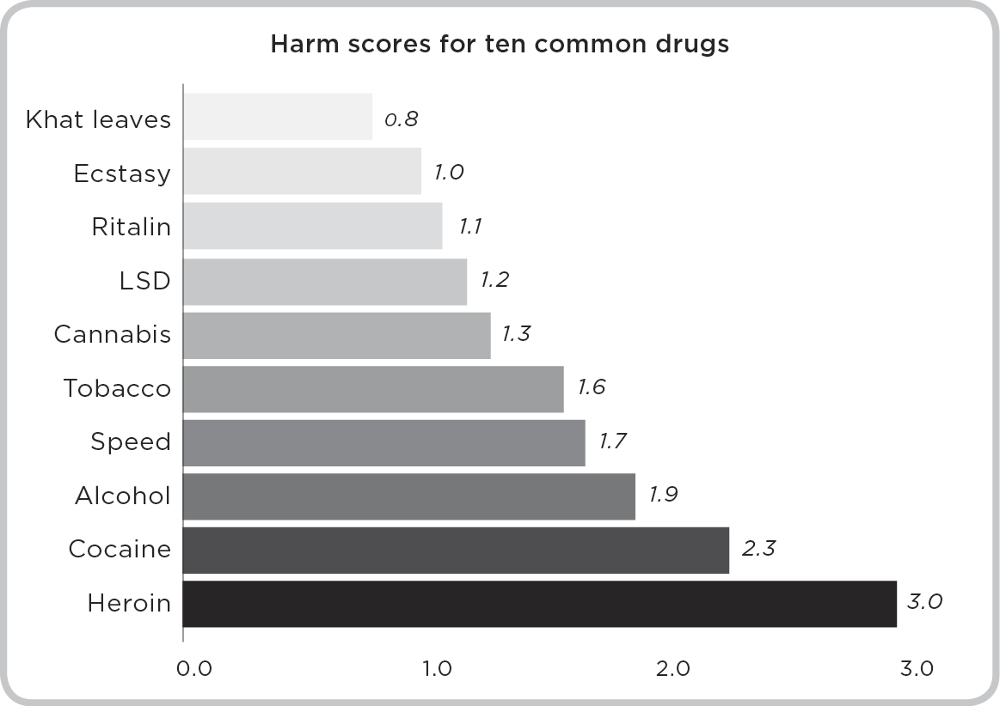

# 2. The Addict in All of Us

## 2.

## The Addict in All of Us

Most war films ignore the boredom that sets in between bouts of action. In Vietnam, thousands of American G.I.s spent weeks, months, or even years just waiting. Some waited for instructions from their superiors, others for the action to arrive. Hugh Penn, a Vietnam vet, recalled that G.I.s passed the time by playing touch football and drinking beer at $1.85 per case. But boredom is the natural enemy of good behavior, and not everyone took to wholesome, all-American pastimes.

Vietnam lies just outside a region of Southeast Asia known as the Golden Triangle. This region encompasses Myanmar, Laos, and Thailand, and was responsible for most of the world’s heroin supply during the Vietnam War. Heroin comes in different grades, and most Golden Triangle labs at the time were producing a chunky, low-grade product known as no. 3 heroin. In 1971, that all changed. The labs invited a series of master chemists from Hong Kong who had perfected a dangerous process known as ether precipitation. They started turning out no. 4 heroin, which was up to 99 percent pure. As the price of heroin rose from $1,240 to $1,780 per kilo, it began to find its way to South Vietnam, where bored G.I.s were just waiting to be entertained.

Suddenly, no. 4 heroin was everywhere. Teenage girls sold vials from roadside stands along the highway between Saigon and the Long Binh U.S. army base. In Saigon, street merchants crammed sample vials into the pockets of passing G.I.s, hoping they would return later for a second dose. The maids who cleaned the army barracks sold vials as they worked. In interviews, 85 percent of the returning G.I.s said they had been offered heroin. One soldier was offered heroin as he disembarked from the plane that brought him to Vietnam. The salesman, a heroin-addled soldier returning home from the war, asked only for a sample of urine so he could convince the U.S. authorities that he was clean.

Few of these soldiers had been within a mile of heroin before joining the army. They arrived healthy and determined to fight, but now they were developing addictions to some of the strongest stuff on the planet. By the war’s end, 35 percent of the enlisted men said they had tried heroin, and 19 percent said they were addicted. The heroin was so pure that 54 percent of all users became addicted—many more than the 5–10 percent of amphetamine and barbiturate users who developed addictions in Vietnam.

Word of the epidemic filtered back to Washington, where government bureaucrats were forced to act. In early 1971, President Richard Nixon sent two U.S. congressmen to Vietnam to gauge the epidemic’s severity. The congressmen, Republican Robert Steele and Democrat Morgan Murphy, rarely saw eye to eye, but they agreed it was a catastrophe. They discovered that ninety enlisted men had died from heroin overdoses in 1970, and expected the numbers to rise by the close of 1971. Both men were approached by heroin vendors during their short stay in Saigon, and they were convinced the drug would find its way back to the United States. “The Vietnam War is truly coming home to haunt us,” Steele and Morgan said in a report. “The first wave of heroin is already on its way to our children in high school.” The *New York Times* printed an enlarged photo of Steele with a vial of heroin in his hand to show how easy it was for G.I.s to access the drug. A *Times* editorial piece argued for the withdrawal of all U.S. troops from Vietnam “to save the country from a debilitating drug epidemic.”

At a press conference on June 17, 1971, President Nixon announced a war on drugs. He looked into the cameras with grave determination, and said, “Public enemy number one in the United States is drug abuse.”

—

Nixon and his aides were worried, not just because the soldiers were addicted to heroin in Vietnam, but about what would happen when they returned home. How do you deal with a sudden influx of 100,000 heroin addicts? The problem was all the worse because heroin was the most insidious drug on the market.

When British researchers assessed the harm of various drugs, heroin was the worst by a big margin. On three scales measuring the likelihood that a drug would inflict physical harm, induce addiction, and cause social harm, heroin scored the highest rating—three out of three. It was by far the most dangerous and addictive drug in the world.

It was hard enough to wean heroin addicts off the drug, but 95 percent relapsed at least once even after they’d detoxed. Few ever completely kicked the habit. Nixon was right to worry. He put together a team of experts who spent every waking hour planning for the onslaught of 100,000 new rehab patients. Nixon’s team decided that the addicted G.I.s should stay in Vietnam until they were clean.

The government settled on a two-pronged attack, bolstering resources in Vietnam and at home. In Vietnam, Major General John Cushman was charged with cracking down on heroin use, which was so widespread that Cushman could see the problem by walking through camp. Doctors confirmed that hundreds if not thousands of men were addicted to the drug. Shocked by the extent of the problem, Cushman pursued a crackdown. At 5:30 one morning, he surprised his troops by confining them to base for twenty-four hours. Everyone was searched, and emergency medical clinics were set up to treat users as they detoxed. Heroin was so hard to come by that desperate users were forced to pay forty dollars per vial—up from three dollars per vial just a day earlier. At first Cushman seemed to have the upper hand, as three hundred men turned themselves in for treatment. But days later, as soon as he relaxed the travel ban, usage rates spiked again. Within a week heroin was selling for four dollars per vial, and more than half of the men who tried to detox were back on the drug.

At home, the government appointed a researcher named Lee Robins to monitor the progress of returning soldiers. Robins was a professor of psychiatry and sociology at Washington University, in St. Louis, where she studied the root causes of psychiatric epidemics. Robins was known for her uncanny ability to ask the right interview questions at just the right time. People trusted her, and she seemed to uncover sensitive information that interview subjects usually preferred not to share. The government decided that Robins was the perfect person to interview and track the recovery of thousands of addicted G.I.s as they returned home.

For Robins this was an extraordinary opportunity. “[Studying] heroin use in a highly exposed normal population was unique,” she reflected in 2010, “because there is nowhere else in the world where heroin is commonly used.”

In the United States itself, heroin use is so rare that [a national survey] of 2,400 adults obtained only about 12 people who had used heroin in the last year. Because heroin users are scarce both worldwide and in the United States, most of our information about heroin comes from treated criminal samples.

But when Robins began following the returning vets, she was confused. What she found made no sense at all.

—

Normally just 5 percent of all heroin addicts stay clean, but Robins found that only 5 percent of the recovering G.I.s *relapsed*. Somehow, 95 percent managed to stay clean. The public, waiting for a calamity after Nixon’s high-profile press conference, was naturally convinced that Robins was hiding the truth. Robins spent years defending the study. She wrote papers with headings like “Why the study was a technical success,” and “The study’s assets.” Her detractors asked her, over and over, how she could be sure her results were accurate, and, if they were accurate, why so few of the G.I.s used the drug after they had returned home. It’s easy to understand their skepticism. She had been appointed by a beleaguered president who declared a war on drugs, and Robins’ report suggested he was gaining the upper hand. Even if she had been above politics, her results were simply too good to be true. In the world of public health, victories take the form of incremental reductions—a 3 percent drop here or a 5 percent drop there. A 90 percent drop in relapse rates was outlandish. But Robins had done everything right. Her experiment was sound and the results were real. The problem was explaining *why* only 5 percent of her G.I. subjects had relapsed.

The answer, it turned out, had been uncovered more than a decade earlier in a U.S. neuroscience lab some eight thousand miles away.

—

Great scientists make their discoveries using two distinct approaches: tinkering and revolutionizing. Tinkering slowly wears down a problem, like water erodes rock, whereas in revolutions, a great thinker sees what no one else can. If the engineer Peter Milner was a tinkerer, the psychologist James Olds was a revolutionary. Together they made a superb team. In the early 1950s, in a small basement lab filled with caged rats and electrical equipment at Montreal’s McGill University, Olds and Milner ran one of the most famous addiction experiments of all time. What made the experiment so remarkable was that it wasn’t actually designed to reshape our understanding of addiction.

In fact, it might have gone unnoticed if Olds had done his job properly.

Olds and Milner met at Montreal’s McGill University in the early 1950s. In many ways they were opposites. Milner’s biggest strength was his technical know-how. He knew all there was to know about rat brains and electrical currents. Olds, on the other hand, lacked experience but overflowed with big ideas. Young researchers floated in and out of Olds’ lab, drawn to his flair and talent for spotting the next big thing. Bob Wurtz, Olds’ first graduate student in the late 1950s, knew Olds and Milner well. According to Wurtz, “Olds didn’t know the front of the rat from the back of the rat, and Milner’s first job was to educate Olds on rat physiology.” But what Olds lacked in technical prowess, he more than made up for with brio and vision. “Jim was a very aggressive scientist,” says Wurtz. “He believed in serendipity—if you see something interesting, you drop everything else. Whenever he and Milner stumbled on something newsworthy, Jim would deal with the media while Milner continued working in the lab.”

Gary Aston-Jones, who also studied with Olds, remembered him the same way. “Olds was focused on big questions. He was always more conceptually driven than technically driven. When we were trying to understand how a fruit fly could learn about the world, Olds dropped to his hands and knees, crawled around on the floor, and pretended to be a fly.” Milner would never have approached the problem that way. Aryeh Routtenberg, a third student who worked with Olds, explained that “Milner was sort of like the other face of Olds. He was quiet, humble, and self-effacing, while Olds would proclaim ‘we’ve made a big discovery!’”

For decades, experts had assumed that drug addicts—laudanum lushes, poppy tea drinkers, and opiate addicts—were predisposed to the condition, somehow wired incorrectly. Olds and Milner were some of the first researchers to turn that idea on its head—to suggest that, perhaps, under the right circumstances, we could all become addicts.

—

Their biggest discovery began modestly. Olds and Milner were trying to show that rats would run to the far end of their cages whenever an electric current zapped their tiny brains. The researchers implanted a small probe, which delivered a burst of electric current to each rat’s brain when the rat pressed a metal bar. To their surprise, instead of retreating, Rat No. 34 stubbornly scampered across his cage and pressed the bar over and over again. Rather than fearing the shocks as many other rats had done earlier, this rat hunted them down. The experimenters looked on as Rat No. 34 pushed the bar more than seven thousand times in twelve hours: once every five seconds without rest. Like an ultramarathon runner who deliriously refuses to stop for sustenance, the rat ignored a small trough of water and a tray of pellets. Sadly, he had eyes only for the bar. Twelve hours after the experiment began, Rat No. 34 was dead from exhaustion.

At first, Olds and Milner were confused. If every other rat avoided the shocks, why would Rat No. 34 do the opposite? Perhaps there was something wrong with his brain. Milner was ready to try the experiment with a different rat when Olds made a bold suggestion. Olds had once crawled around to imagine life as a fruit fly, and now he tried his hand at reading the mind of a rat. Considering Rat No. 34’s behavior carefully, he became convinced that the rat was *enjoying* the shocks. It wasn’t that he was seeking out pain, but rather that the shocks felt good. “The genius of Jim Olds was that he was open-minded enough and crazy enough to think that the animal *liked* being shocked,” Aston-Jones said. “At the time, no one imagined that electrical stimulation in the brain could be pleasurable, but Olds was crazy enough to think the animal was having a good time.”

So Olds investigated. He removed the probe from the rat’s brain and noticed that it was bent. “Olds had been aiming for the mid-brain, but the probe bent into the rat’s septum,” says Aston-Jones. A fraction of an inch made all the difference between delight and discomfort. Olds took to calling this area of the brain the “pleasure center,” a simplistic name that nonetheless captures the euphoria that rats—and dogs, goats, monkeys, and even people—feel when the area is stimulated. Some years later, when neuroscientist Robert Heath inserted an electrode into a depressed woman’s pleasure center, she began to giggle. He asked why she was laughing, and though she couldn’t offer an explanation, she told him that she felt happy for the first time in as long as she could remember. As soon as Heath removed the probe, the patient’s smile disappeared. She was depressed again—and worse, she now knew what it felt like to be happy. She wanted more than anything for the probe to remain implanted, delivering regular shocks like a small hedonic pacemaker. Like Olds and Milner before him, Heath had shown how addictive euphoria could be.

—

After the demise of Rat No. 34, Olds and Milner found the same addictive behavior when they stimulated the pleasure center of other rats. Those rats, too, ignored food and water while they pushed the little bar over and over again. Aryeh Routtenberg worked on some of these follow-up experiments, and he recalls that the rats behaved like addicts. The bar-pushing rats were no different from rats that had addictive substances injected directly into their brains. “We threw all sorts of feel-good drugs at the animals—amphetamines, chlorpromazine, monoamine oxidase inhibitors—and they behaved just like the self-stimulating rats.” Routtenberg remembers an experiment that showed the power of the pleasure center:

One of the nice things about being a professor is that you can study whatever you like. I wanted to see what would happen if I made the bar-pressing animals drunk. I injected the alcoholic equivalent of a three-martini lunch into several rats, who just fell over. We lifted them up—as you’d drag a drunkard from the bar—and we led them over to the small metal bar. We laid them down so their heads brushed against the bar, which delivered a shock to their brains. In no time, these rats started pressing the bar over and over again. They were catatonic just a minute ago, but now they looked absolutely normal! After ten or fifteen minutes, we disabled the shocks, and the rats fell back into a stupor.

That wasn’t the only reason why the researchers saw the rats as tiny addicts. They showed the same restlessness that human drug addicts show between hits. When the researchers prevented the rats from shocking themselves more than once every few minutes, the rats took to drinking lots of water to pass the time. “The minute the reward stopped, they’d start drinking like crazy,” recalls Routtenberg. “I’d come back between experimental sessions and they were sitting there, completely bloated! It’s like they were doing something—anything—to pass the time. The reward was so great that they would need to find a way to pass the time until the next reward was available.”

Word of the experiments got out, and the researchers began to hear rumors. “We heard that the military was training goats,” Bob Wurtz recalls. “They would guide the goats to bring ammunition to soldiers, or even to carry bombs to the enemy.” The soldiers could encourage the goats to walk in a specific direction by shocking or withholding shocks from the pleasure center. The research influenced how experts like Wurtz, Aston-Jones, and Routtenberg understood addiction. Olds and Milner originally believed that Rat No. 34 was predisposed to be an addict. They assumed that a problem with his internal wiring had driven him to place electric stimulation above all else—even food, water, and ultimately life. But at Olds’ urging, they realized that there was nothing wrong with Rat No. 34. He wasn’t an addict by nature. He was just an unfortunate rat that happened to be in the wrong place at the wrong time.

—

This is one of the great lessons from Olds and Milner’s experiment. Rat No. 34 behaved like an incurable addict but that didn’t mean there was something wrong with his brain. Like the Vietnam G.I.s, he was a victim of circumstance. He was simply responding as any rat would have done when a probe delivered shocks to his pleasure center.

Routtenberg wondered if this might tell us something about addiction in humans. But perhaps anyone could descend into oblivion like Rat No. 34. “We started to think of addiction as a form of learning. You can think of addiction as part of memory,” says Routtenberg. Addicts had simply learned to link a particular behavior with an appealing outcome. For Rat No. 34, this was stimulation of his pleasure center; for a heroin addict, the flush of pleasure from a fresh hit.

To measure the link between addiction and memory, Routtenberg visited the local pet store and bought a squirrel monkey named Cleopatra. Ethics boards weren’t as strict as they are now. “I had my own lab room, so I could do whatever I wanted. I operated on her and put electrodes in the reward systems of her brain. This had never been done before with a monkey.” Routtenberg placed Cleopatra in a cage in front of two metal bars. The first sent an electrical current to her pleasure center, and the second released a fresh supply of food. At first Cleopatra pushed the bars randomly, but very quickly she began to behave like Rat No. 34, ignoring the food bar and pressing the electric shock bar over and over again. Olds saw what Routtenberg had done, and he was delighted. “He came down to the lab with a friend, who was a big-time researcher at Johns Hopkins, and showed him what Cleopatra was doing,” Routtenberg says. “It was one of the proudest days of my life.” Later, Routtenberg removed Cleopatra from the cage for hours or even days. Outside the cage, she detoxed, becoming the same healthy monkey she had been when she first arrived at the lab. But as soon as Routtenberg returned her to the cage, she would frantically begin pressing the bar again. Even when the bar was removed from the cage, she would stand where it had once been. As Routtenberg guessed, Cleopatra’s addiction had left a powerful imprint in her long-term memory.

—

Jim Olds’ lab held the solution to Lee Robins’ conundrum. The reason why her Vietnam vets escaped their heroin addictions was because they had escaped the circumstance that ensnared them. That was the case for Cleopatra, Aryeh Routtenberg’s squirrel monkey, who was every bit the addict inside her cage. She pounded the metal bar that delivered shocks to her pleasure center over and over again. She ignored her food and water. This cage was to Cleopatra what Vietnam was to the bored G.I.s who developed a taste for heroin. Cleopatra was healthy until she joined the lab. When Routtenberg eventually removed her from the cage, she became healthy again. But when she sat inside her cage, the addiction returned with a vengeance.

Cleopatra returned to her cage, but few of the G.I.s ever returned to Vietnam. They arrived home to a completely different life. There was no trace of the jungle; the steamy summers in Saigon; the rattle of gunfire, or the chop of helicopter blades. Instead, they went grocery shopping, they returned to work, they endured the monotony of suburbia, and enjoyed the pleasures of home-cooked meals. Both Cleopatra and the soldiers showed that Routtenberg was right: addiction embeds itself in memory. For Cleopatra, the cage was a trigger. It transported her back to the time when she had been an addict, and she couldn’t help falling back on old habits. The lucky Vietnam vets never confronted those memories, because once they left Vietnam they escaped the cues that went along with the act of shooting up.

This is why most heroin users struggle to stay clean. Like Cleopatra, they return to the scene of the crime over and over again. They see friends who remind them of a time when they were addicts; they live in the same homes; they walk through the same neighborhoods. Nothing changes once they’re clean, except the fact that instead of giving in to the addiction, they’re resisting it every day. This is why the temptation is so great. What else are they supposed to do when every sight, smell, and sound rekindles the moment of bliss that follows a hit?

—

Isaac Vaisberg, a former gaming addict, knows the dangers of returning to the scene of the crime. Nothing marks Isaac as a natural candidate for addiction. He was born in Venezuela in 1992 to a wonderfully supportive mom and an overworked but attentive dad. When Isaac was a boy, his parents divorced and he moved to Miami with his mom. His dad remained in Venezuela, but the two talked often, and Isaac visited when he wasn’t in school. His grades were stellar, rarely dropping below an *A*. At the end of his junior year of high school, he scored 2200 out of a possible 2400 on the SATs, which placed him in the top 1 percent of all students in the United States. He was admitted to Worcester Academy, one of the country’s most competitive boarding schools, not too far from Boston, and later to American University in Washington, D.C. Isaac wasn’t just a scholar—he was also an athlete. Worcester granted him a football scholarship, and he arrived in great physical shape, ready to play as a first-string linebacker.

Unfortunately, that’s only half the story. Isaac was lonely. “My parents got divorced when I was very young, and I ended up ping-ponging between the United States and Venezuela. Because of that ping-ponging, I was adept at forming new relationships, but not very good at forming deep relationships.” Instead, he found friends online.

When Isaac was fourteen, he started playing World of Warcraft. WoW is addictive for a number of reasons, but Isaac found the game’s social dimension irresistible. Like many players, he joined a guild, a small band of players who share resources and chat regularly in guild-specific chat rooms. His guild-mates became his closest friends, and their friendship ultimately came to stand in for the meaningful relationships he lacked in the offline world.

Isaac’s first dangerous binge began during his junior year in high school. “I had picked up and dropped World of Warcraft many times, but this time it became my sole means of socializing and my sole release. I got a small dopamine hit every night, and it helped me overcome my anxieties.” He stopped sleeping, his grades plummeted, and he became physically sick when his mother insisted he go to school. “I would flip out and have panic attacks. Getting in the car in the morning I’d feel nauseated. The second I knew I didn’t have to go to school, these symptoms went away.” Isaac ultimately recovered after this first binge, and by the end of that school year he was doing so well that he aced his SATs.

Isaac’s second binge began a couple of months into his time at Worcester Academy. Left in his dorm room without supervision, he rejoined his old guild and rekindled the online friendships he’d formed the year before. Soon it became an obsession again. “When I arrived at Worcester Academy, I weighed about one-ninety-five. I was fit and playing football. By the end of the first semester, I weighed about two-thirty-five. I lost a significant amount of hair on my head, quit the football team, and had *C*s across the board.” Isaac was resilient, though. He managed to complete his senior year and gain acceptance to American University. At this point he still believed his binges were flukes. He wasn’t concerned that his addiction might follow him to college.

His first semester at American was a success—he aced his classes and remained fit and healthy. In his second semester, though, he became stressed. He decided to “play just a bit” of WoW as a release, and ultimately failed his second semester classes. Isaac’s transcript was a roller coaster of *A*s and *F*s, and his mom was so worried that she arrived unannounced and presented him with a pamphlet for the reSTART addiction recovery center, located just outside Seattle. He agreed to enroll in an inpatient program, but only after logging in to his WoW account to tell his guild-mates that he’d be offline for a while.

reSTART is the world’s first gaming and Internet addiction treatment center. Its founders recognize that Internet use differs from substance addiction, because it’s almost impossible to return to society without using the Internet. You can hold a job, pay your bills, and communicate without using drugs and alcohol, but not without using the Internet. Echoing the green movement, the center therefore aims to teach patients how to use the Internet “sustainably,” rather than encouraging them to avoid it altogether.

Isaac began his six-week program with enthusiasm, making friends, painting, hiking the spectacular trails around the center, and regaining his strength at its gym. He formed close bonds with some of the mentors, who told him that WoW had given him an illusion of control over his life. Outside the game his world had continued to crumble, but that seemed to matter less and less as he conquered one WoW quest after another. Despite making good progress, at times he felt frustrated. Though reSTART had helped, Isaac saw his time there as a roadblock that distracted him from finishing college and moving on to a healthier, self-sufficient phase of his life. He couldn’t really be “better” until he settled back into the real world. Though he went as far as buying an airline ticket to D.C. online, he ultimately stayed for the full six weeks.

Then Isaac made his biggest mistake. “I got through the rest of the program, my chest puffed up, and I was a little bit more confident in what I was doing. But when it came time to present my life balance plan at the end of the program, the one thing everybody criticized was my decision to go back to D.C.” Isaac describes this using the language you’d expect from a veteran gamer: “I just felt like I couldn’t leave something unconquered. I couldn’t leave American University without my degree—it just wasn’t gonna happen. Against medical advice I decided to go back east.”

Isaac’s experience differs from the lives of Lee Robins’ Vietnam vets. Instead of escaping the context of his addiction forever, Isaac returned to D.C. For two or three months, things went well. He got a job, he started working as a math tutor and made good money, and his guidance counselor admitted him back into American University. Things were looking up—until they weren’t.

Isaac told me that the most dangerous time for an addict is the first moment when things are going so well that you believe you’ve left the addiction behind forever. “You’re convinced that you’re fixed, so you can go back to doing what you were doing before. I let my guard down, and a buddy of mine sent me a text message that said, ‘Hey, you wanna play with us a little bit?’ And I went, ‘Hey, sure!’”

That was Thursday, February 21, 2013. Isaac is sure of the date, because it left an indelible imprint in his memory. Two days later he was scheduled to tutor a kid who had an algebra exam, but he missed the appointment. He didn’t go to class on Monday either, and then he spent five weeks alone in his apartment. He didn’t leave once and he didn’t shower. In exchange for a small tip, his doorman brought food he ordered by phone to his room. His place began to smell and empty containers towered around his desk. He played twenty hours a day and collapsed, numb, for a few hours of sleep before returning to the game when he awoke. He completed one mission after another, chatted with his guild-mates for days, and lost touch with the outside world. Five weeks passed quickly. He missed one hundred and forty-two phone calls (another number he says he can’t forget), but, for some reason that escapes him even now, he decided to answer the one hundred and forty-third call. It was his mother, and she told him that she was visiting in two days.

After one final binge, he decided to clean his apartment and take a shower. This was his “rock-bottom moment.” He was disgusted by what he saw in the mirror. He’d put on sixty pounds of pure fat, his hair was greasy, and his clothes were filthy. He described a recurring vision that, even eighteen months later, brought him close to tears:

When I was growing up, my dad didn’t have a lot of money. He started a business, and left for work at five in the morning and came home around nine at night. He was very happy when he got home. He’d give me a huge hug, grab a little glass of Scotch, go to his chair by the window and open it up so he could enjoy the breeze. And then he’d do it all over again, every single day.

I had this image of him walking into my apartment, and grabbing a little glass of Scotch, going to his chair, and crying. I had never seen my dad cry. He always had his chest up, and he was always strong. And I imagined him crying in his chair, wondering what he did wrong with me. It hurts just talking about it. It was this burning pain in my heart that he would feel that way for *my* fuck-up.

Isaac took his mom to dinner, where he broke down and told her he’d fallen off the wagon. He told her he needed to try reSTART again, but this time with a better attitude. He wouldn’t return to D.C., and after the six-week inpatient program ended, he’d enroll in a seven-month after-care outpatient program.

Isaac was true to his word. He embraced the inpatient program and felt comforted knowing that the outpatient program would give him extra support as he grew used to living and working outside the center. The outpatient program made all the difference. Like other outpatients, Isaac spent between twenty and thirty hours at the center each week, while also holding down a part-time job. He lived with several former inpatients, who supported each other and vigilantly ensured that their roommates didn’t relapse.

Isaac decided to stay in the Seattle area, near reSTART. He visits the center often, but now spends most of his time running a CrossFit gym. In April 2015, he bought the gym from its former owners, and after just four months under his care its membership tripled. The gym gives him a healthy way to fulfill his psychological needs: he has plenty of friends, remains active and healthy, and sets business-oriented goals that keep him motivated.

Isaac Vaisberg, like Robins, Milner, Olds, and their students, taught the world a profound lesson about addiction and its victims: there’s so much more to addiction than an *addictive personality.* Addicts aren’t simply weaker specimens than non-addicts; they aren’t morally corrupt where non-addicts are virtuous. Instead, many, if not most, of them are unlucky. Location isn’t the only factor that influences your chances of becoming an addict, but it plays a much bigger role than scientists once thought. Genetics and biology matter as well, but we’ve recognized their role for decades. What’s new, and what only became clear in the 1960s and 1970s, is that addiction is a matter of environment, too. Even the sturdiest of our ranks—the young G.I.s who were free of addiction when they left for Vietnam—are prone to weakness when they find themselves in the wrong setting. And even the most determined addicts-in-recovery will relapse when they revisit the people and places that remind them of the drug.

—

Time has made a fool of the experts who once believed that addiction was reserved for a wretched minority, because, like Isaac Vaisberg, tens of millions of people in the developed world today exhibit one or more behavioral addictions. The very concept was foreign to Olds and Milner in the 1950s, and to Robins in the 1970s. People were addicted to substances—not behaviors. The feedback they got from behaviors alone could never rise to the euphoric intensity of injected heroin. But just as drugs have become more powerful over time, so has the thrill of behavioral feedback. Product designers are smarter than ever. They know how to push our buttons and how to encourage us to use their products not just once but over and over. Workplaces dangle carrots that always seem to be just out of reach. The next promotion is around the corner; the next sales bonus is one sale away.

As for Rat No. 34, hammering away at the bar in his cage, our brains host a flurry of electrical activity when we’re engaged with an addictive behavior. For decades, researchers believed this activity was the root of addiction: mimic the right brain patterns and you’d create an addict. But the biology of addiction is far more complicated than simply stimulating a clump of neurons. Addiction, as it was for Isaac Vaisberg, the Vietnam vets, and Rat No. 34, is a matter of learning that the addictive cue—a game, a place paired with heroin, or a small metal bar—treats loneliness, disaffection, and distress.
