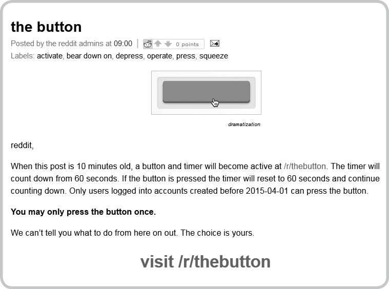
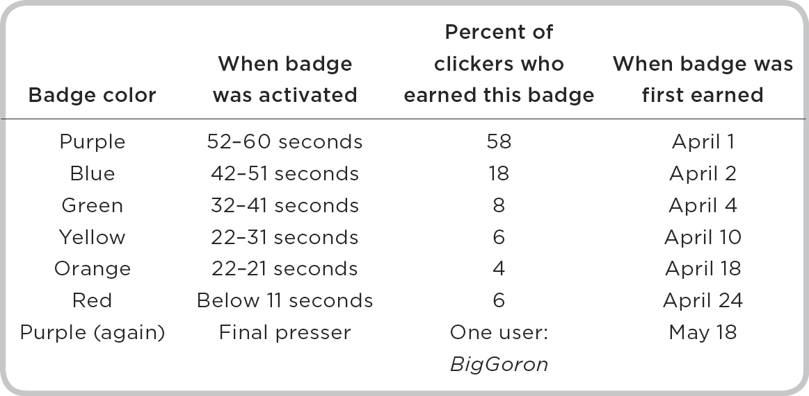
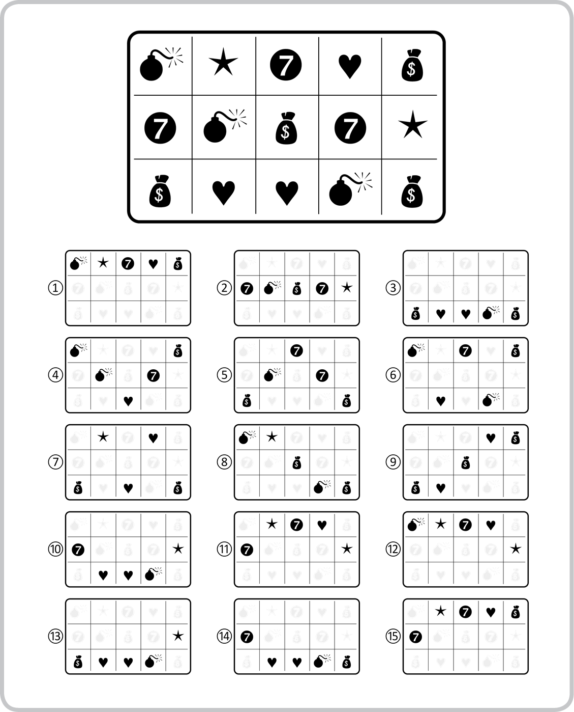

# 5. Feedback

## 5.

## Feedback

Last week I stepped into an elevator on the eighteenth floor of a tall building in New York City. A young woman inside the elevator was looking down at the top of her toddler’s head with embarrassment as he looked at me and grinned. When I turned to push the lobby button, I saw that every button had already been pushed. Kids love pushing buttons, but they only push *every* button when the buttons light up. From a young age, humans are driven to learn, and learning involves getting as much feedback as possible from the immediate environment. The toddler who shared my elevator was grinning because feedback—in the form of lights or sounds or any change in the state of the world—is pleasurable.

This quest for feedback doesn’t end at adulthood. In 2012, an ad agency in Belgium produced an outdoor campaign that quickly went viral. The agency, Duval Guillaume Modem, was trying to convince the Belgian public that the TNT television network was broadcasting shows that were packed with excitement. The campaign’s producers placed a big red button on a pedestal in a quaint square in a sleepy town in Flanders. A big arrow hung above the button with a simple instruction: *Push to* *add drama.* The campaign worked beautifully because buttons, even in quiet Flemish squares, beg to be pushed. (The sign was a nice but unnecessary touch—with mounting curiosity, people will eventually push a big conspicuous button even if it isn’t labeled.) A couple of adults sidled up to the button before braver souls went one step further and pressed down. You can see the glint in each person’s eye as he or she approaches the button—the same glint that came just before the toddler in my elevator raked his tiny hand across the panel of buttons. (The ad’s YouTube video has more than fifty million hits. As promised by the arrow, the result is dramatic, featuring bumbling paramedics, a fistfight, a bikini-clad woman on a motorbike, and a shootout.)

The button in Flanders promised a reward, but people will also push buttons that promise nothing at all. This was the case when the Reddit web community posted an April Fools’ Day prank in 2015. Reddit, which celebrated its tenth birthday in June 2015, is currently the thirtieth most popular website on the Internet, attracting slightly more traffic than Pinterest and slightly less traffic than Instagram. It houses a motley collection of pages devoted to news, entertainment, and social networking. Users celebrate some posts by clicking upward-pointing arrows, and condemn others by clicking downward-pointing arrows. Each post features a running score that rises and falls as users bestow these upvotes and downvotes. To give you a sense of Reddit’s irreverence, one of the most upvoted posts of all time is titled “Waterboarding in Guantanamo Bay sounds rad if you don’t know what either of those things mean.”

On April 1, 2015, Reddit unleashed a prank on its thirty-five million registered users. One of the site’s administrators introduced the prank in an announcement on the Reddit blog page:

The button’s mechanics were simple: a timer next to the button would descend from sixty seconds to zero. Every time a user clicked the button, the counter would return to sixty seconds to restart its downward march. Users could only click the button once, so the timer would reach zero eventually. (Even if every one of Reddit’s subscribers clicked the button just before it reached zero, the timer would reach zero after sixty-six years.)

At first, hordes of users visited the page and, almost without fail, pushed the button before it had descended much below sixty seconds. These users received a small purple badge next to their usernames, with a number that indicated how many seconds were left on the countdown timer when they clicked. Users who were especially trigger-happy had purple badges that broadcast “59 seconds”—a number that suggested the user was impatient. The button didn’t appear to do much, apart from turning the badge purple, so it wasn’t clear why some users were staying up all night to wait for the timer to fall. Such was the lure of the button—like elevator buttons to toddlers—that they were willing to forgo sleep for the chance to push the button at a low number.

Interest in the campaign surged. Users who hadn’t yet pressed the button had gray badges, and many of them counseled other gray-badged users to join the “don’t press!” camp. If enough people refused to press the button, they reasoned, it would reach zero more quickly, and the result of the campaign would reveal itself sooner. But hundreds of thousands of users couldn’t resist the urge to press, and the timer crept down very slowly. On April 2, the timer reached fifty seconds for the first time, and the user who pressed the button received a blue badge. All users who clicked the button when it had fallen below fifty-one seconds received a blue badge instead of a purple one. Users quickly learned that their reward for clicking the button as it dropped below each ten-second interval was a different-colored badge—not a huge reward, perhaps, but users formed camps based on the color of their badges, and later pushers wore their badges with special honor. Here’s a full list of how long it took for the clock to reach each badge, and how many users earned each one:

As the colors revealed themselves, one Reddit user named Goombac created avatars for each camp, and christened them with names like *The Illemonati* (yellow, of course), *The Emerald Council*, and *The Redguard.* Forty-eight days after the prank began, BigGoron pressed the button for the last time. After his push, the countdown timer descended to zero. Reddit hailed BigGoron the *Pressiah*, and users bombarded him with questions. How had he waited when so many before him had fallen? (He noticed that the timer had reached one second a number of times, so he began to watch and wait.) What comes next? (“I advocate peace—please let the crusades end.”) In the end, when the timer reached zero, nothing happened at all. Users formed camps united by color, they found their Pressiah, and then slowly returned to their lives as the camps disbanded.

If this all sounds frivolous, it should—here were millions of people bonded by a button that did nothing at all. The pull of feedback is so great that people will spend weeks online waiting to learn what will happen when they refrain from pushing a virtual button for sixty seconds.

—

In 1971, a psychologist named Michael Zeiler sat in his lab across from three hungry White Carneaux pigeons. The birds looked more like plump doves than common gray pigeons, and they were good eaters and quick learners. At the time, many psychologists were trying to understand how animals respond to different forms of feedback. Most of the work focused on pigeons and rats, because they were less complicated and more patient than humans, but the research program had lofty aims. Could the behavior of lower-order animals teach governments how to encourage charity and discourage crime? Could entrepreneurs inspire overworked shift workers to find new meaning at work? Could parents learn how to shape perfect children?

Before Zeiler could change the world, he had to work out the best way to deliver rewards. One option was to reward every desirable behavior, in the same way that some factory workers are rewarded for every gadget they assemble. Another was to reward those same desirable behaviors on an unpredictable schedule, creating some of the mystery that encourages people to buy lottery tickets. The pigeons had been raised in the lab, so they knew the drill. Each one waddled up to a small button and pecked persistently, hoping that it would release a tray of Purina pigeon pellets. The pigeons were hungry, so these pellets were like manna. During some trials, Zeiler would program the button so it delivered food every time the pigeons pecked; during others, he programmed the button so it delivered food only some of the time. Sometimes the pigeons would peck in vain, the button would turn red, and they’d receive nothing but frustration.

When I first learned about Zeiler’s work, I expected the consistent schedule to work best. If the button doesn’t predict the arrival of food perfectly, the pigeon’s motivation to peck should decline, just as a factory worker’s motivation would decline if you only paid him for some of the gadgets he assembled. But that’s not what happened at all. Like tiny feathered gamblers, the pigeons pecked at the button more feverishly when it released food 50–70 percent of the time. (When Zeiler set the button to produce food only once in every ten pecks, the disheartened pigeons stopped responding altogether.) The results weren’t even close: they pecked almost twice as often when the reward wasn’t guaranteed. Their brains, it turned out, were releasing far more dopamine when the reward was unexpected than when it was predictable. Zeiler had documented an important fact about positive feedback: that less is often more. His pigeons were drawn to the mystery of mixed feedback just as humans are attracted to the uncertainty of gambling.

Thirty-seven years after Zeiler published his results, a team of Facebook web developers prepared to unleash a similar feedback experiment on hundreds of millions of humans. Facebook has the power to run human experiments on an unprecedented scale. The site already had two hundred million users at the time—a number that would triple over the next three years. The experiment took the form of a deceptively simple new feature called a “like” button. Anyone who has used Facebook knows how the button works: instead of wondering what other people think of your photos and status updates, you get real-time feedback as they click (or don’t click) a little blue-and-white thumbs-up button beneath whatever you post. (Facebook has since introduced other feedback buttons, so you’re able to communicate more complex emotions than simple liking.)

It’s hard to exaggerate how much the “like” button changed the psychology of Facebook use. What had begun as a passive way to track your friends’ lives was now deeply interactive, and with exactly the sort of unpredictable feedback that motivated Zeiler’s pigeons. Users were gambling every time they shared a photo, web link, or status update. A post with zero likes wasn’t just privately painful, but also a kind of public condemnation: either you didn’t have enough online friends, or, worse still, your online friends weren’t impressed. Like pigeons, we’re more driven to seek feedback when it isn’t guaranteed. Facebook was the first major social networking force to introduce the like button, but others now have similar functions. You can like and repost tweets on Twitter, pictures on Instagram, posts on Google+, columns on LinkedIn, and videos on YouTube.

The act of liking subsequently became the subject of etiquette debates. What did it mean to refrain from liking a friend’s post? If you liked every third post, was that an implicit condemnation of the other posts? Liking became a form of basic social support—the online equivalent of laughing at a friend’s joke in public. Likes became so valuable that they spawned a start-up called Lovematically*.* The app’s founder, Rameet Chawla, posted this introduction on its homepage:

It’s our generation’s crack cocaine. People are addicted. We experience withdrawals. We are so driven by this drug, getting just one hit elicits truly peculiar reactions.

I’m talking about Likes.

They’ve inconspicuously emerged as the first digital drug to dominate our culture.

Lovematically was designed to automatically like every picture that rolled through its users’ newsfeeds. If likes were digital crack, Lovematically’s users were pushing the drug at the heavily discounted rate of free. It wasn’t even necessary to impress them anymore; any old post was good enough to inspire a like. At first, for three experimental months, Chawla was the app’s only user. During that time, he automatically liked every post in his feed, and, apart from enjoying the warm glow that comes from spreading good cheer, he also found that people reciprocated. They liked more of his photos, and he attracted an average of thirty new followers a day, a total of almost three thousand followers during the trial period. On Valentine’s Day 2014, Chawla allowed five thousand Instagram users to download a beta version of the app. After only two hours, Instagram shut down Lovematically for violating the social network’s Terms of Use.

“I knew way before launching it that it would get shut down by Instagram,” Chawla said. “Using drug terminology, you know, Instagram is the dealer and I’m the new guy in the market giving away the drug for free.” Chawla was surprised, though, that it happened so quickly. He’d hoped for at least a week of use, but Instagram pounced immediately.

—

When I moved to the United States for grad school in 2004, online entertainment was limited. These were the days before Instagram, Twitter, and YouTube, and Facebook was limited to students at Harvard. I had a cheap Nokia phone that was indestructible but primitive, so the web was tethered to my dorm room. One evening, after work, I stumbled on a game called Sign of the Zodiac (*Zodiac* for short) that demanded very little mental energy. Zodiac was a simple online slot machine much like the actual slot machines in casinos: you decided how much to wager, and then you lazily clicked a button over and over again and watched as the machine spat out wins and losses. At first I played to relieve the stress of long days filled with too much thinking, but the brief ding that followed each small win, and the longer melody that followed each major win, hooked me fast. Eventually screenshots of the game would intrude on my day. I’d picture five pink scorpions lining up for the game’s highest jackpot, followed by the jackpot melody that I can still conjure today. I had a minor behavioral addiction, and these were the sensory hangovers of the random, unpredictable feedback that followed each win.

My Zodiac addiction wasn’t unusual. For thirteen years Natasha Dow Schüll, a cultural anthropologist, studied gamblers and the machines that hook them. The following descriptions of slot machines come from gambling experts and current and former addicts:

Slots are the crack cocaine of gambling.

They’re electronic morphine.

They’re the most virulent strain of gambling in the history of man.

Slots are the premier addiction delivery device.

These are sensationalized descriptions, but they capture how easily people become hooked on slot machine gambling. I can relate, because I became addicted to a slots game that wasn’t even doling out real money. The reinforcing sound of a win after the silence of several losses was enough for me.

In the United States, banks aren’t allowed to handle online gambling winnings, which makes online gambling practically illegal. Very few companies are willing to fight the system, and the ones that do are quickly defeated. That sounds like a good thing, but free and legal games like Sign of the Zodiac are also dangerous. At casinos, the deck is stacked heavily against the player; on average the house has to win. But the house doesn’t have to win in a game without money. As David Goldhill, the C.E.O. of the Game Show Network, which also produces many online games, told me, “Because we’re not restricted by having to pay real winnings, we can pay out one hundred and twenty dollars for every hundred dollars played. No land-based casino could do that for more than a week without going out of business.” As a result, the game can continue forever because the player never runs out of chips. I played Sign of the Zodiac for four years and rarely had to start a new game. I won roughly 95 percent of the time. The game only ended when I had to eat or sleep or attend class in the morning. And sometimes it didn’t even end then.

In contrast to free games, casinos win most of the time—but they have a clever way of convincing gamblers that the outcomes are reversed. Early slot machines were incredibly simple devices: the player pulled the machine’s arm (hence the term “one-armed bandit”) to spin its three mechanical reels. If the center of the reels displayed two or more of the same symbol when they stopped spinning, the player won a certain number of coins or credits. Today, slot machines allow gamblers to play multiple lines, in some cases as many as several hundred at once. The machine below, for example, allows you to play fifteen lines:

Say the machine charges ten cents per spin. If you decide to play all fifteen lines, each spin will cost you $1.50. Basically, you’re playing fifteen spins at once, instead of drawing the experience out by playing a single spin fifteen times. Casinos are very happy for you to play this way: if they’re going to beat you, they’ll do it fifteen times more quickly. But every time you play, you’re fifteen times more likely to win on at least one line, and the machine will celebrate with you by flashing the same bright lights and playing the same catchy tunes. Now imagine you play all fifteen lines, costing you $1.50, and one of your lines spins two bombs in a row, as line four does, above. If two bombs are worth a payout of ten credits, you get a payout of $1. Not bad—until you realize the net effect of that spin is a loss of fifty cents (your $1 payout minus the cost of the spin at $1.50). And yet you enjoy the positive feedback that follows a win—a type of win that Schüll and other gambling experts call a “loss disguised as a win.”

Mike Dixon, a psychologist, has analyzed these disguised losses. With several colleagues, he focused on a game called Lucky Larry’s Lobstermania (which I found online and played for three hours while I was supposed to be writing this book—I was lucky that U.S. laws forced me to play the free version). Lobstermania allows players to spin up to fifteen lines simultaneously. The game features five reels with three visible symbols per reel, for a total of more than 259 million possible outcomes. Dixon and his team calculated that gamblers are more likely to strike a loss disguised as a win than a genuine win any time they play six or more lines per spin.

Losses disguised as wins only matter because players don’t classify them as losses—they classify them as wins. Dixon and his team hooked up a group of novice gamblers to electrodes while they played Lobstermania. He gave them ten dollars each, and told them they could win up to an additional twenty dollars. They played for half an hour and spun, on average, 138 times. After each spin, a machine registered minute changes in how much the students were sweating—a sign that the event was emotionally meaningful. Lobstermania, like many modern video slots, is full of reinforcing feedback. In the background, the bouncy B-52s song “Rock Lobster” plays over and over whenever you spin. It’s replaced by silence after losing spins and by louder, bouncier versions of the song after wins. Lights flash and bells ding just the same whether the spin represents a true win or a loss disguised as a win. The students sweated more when they won than when they lost—but they sweated just as much when their losses were disguised as wins as when those wins were genuine. This is what makes modern slot machines—and modern casinos—so dangerous. Like the little boy who hit every button in my elevator, adults never really grow out of the thrill of attractive lights and sounds. If our brains convince us that we’re winning even when we’re actually losing, how are we supposed to muster the self-control to stop playing?

After a string of losses, even die-hard gamblers begin to lose interest, some faster than others. This is a big problem for casinos, which aim to keep the gambler in front of the machine for as long as possible. It would be easy to change the odds of winning so that players become more and more likely to win after a series of losses, but, unfortunately for casinos, this is illegal in the U.S. The odds need to stay consistent across every spin, regardless of the previous run of outcomes. Natasha Dow Schüll told me that casinos have come up with some creative solutions. “Many casinos use ‘luck ambassadors.’ They sense that you’re reaching your pain point—the moment when you’re about to leave the casino—and they dispatch someone to give you a bonus.” These bonuses were either meal vouchers or a free drink or even cash or gambling credits. Bonuses are classified as “marketing” rather than a way of changing the odds of winning, so regulators turned a blind eye. With a new dose of positive reinforcement, gamblers tended to continue playing anew, until they reached another pain point after a series of losses.

It’s expensive, however, to keep dozens of luck ambassadors on the floor, not to mention paying a team of data analysts to identify frustrated gamblers. One man, a casino consultant named John Acres, proposed a creative solution that skirted the relevant laws. Schüll explained Acres’ technique. “As you play, a tiny portion of what you lose goes into a pot which counts as the marketing bonus pot. An algorithm within the machine senses your pain points, and knows ahead of time what the next outcome will be.” Normally the algorithm sits by and lets the machine dish out a randomly drawn outcome. When the player reaches a pain point, though, it intervenes. “If the machine sees that, oh, that outcome sucks,” Schüll said, “instead of BAR, BAR, CHERRY, it goes ‘chink’ and nudges the third reel so that it displays BAR—a jackpot outcome of three BARs.” Those winnings are taken from the “marketing bonus pot” that grew in size while the player continued to lose. Instead of relying on a human luck ambassador, the machine plays that role itself. Schüll has seen many dastardly tactics in her time investigating casinos, but this one she calls “shocking.” When she asked Acres how this wasn’t “a complete violation of laws in place to protect people from precisely this,” he replied, “Well, laws are made to be broken.”

—

The success of slot machines is measured by “time on device.” The longer the average player stays seated at the machine, the better the machine. Since most players lose more money the longer they play, time on device is a useful proxy for profitability. Video game designers use a similar measure, which captures how engaging and enjoyable their games are. The difference between casinos and video games is that many designers are more concerned with making their games fun than with making buckets of money. Bennett Foddy, who teaches game design at New York University’s Game Center, has created a string of successful free-to-play games, but each was a labor of love rather than a moneymaking vehicle. They’re all available on his website, foddy.net, and apart from attracting limited advertising revenue, they aren’t a significant source of income, despite some having achieved cult status.

“Video games are governed by microscopic rules,” Foddy says. “When your mouse cursor moves over a particular box, text will pop up, or a sound will play. Designers use this sort of micro-feedback to keep players more engaged and more hooked in.” A game must obey these microscopic rules, because gamers are likely to stop playing a game that doesn’t deliver a steady dose of small rewards that make sense given the game’s rules. Those rewards can be as subtle as a “ding” sound or a white flash whenever a character moves over a particular square. “Those bits of micro-feedback need to follow the act almost immediately, because if there’s a tight pairing in time between when I act and when something happens, then I’ll think I was causing it.” Like kids who push elevator buttons to see them light up, gamers are motivated by the sense that they’re having an effect on the world. Remove that and you’ll lose them.

The game Candy Crush Saga is a prime example. At its peak in 2013, the game generated more than $600,000 in revenue per day. To date, its developer, King, has earned around $2.5 billion from the game. Somewhere between half a billion and a billion people have downloaded Candy Crush Saga on their smartphones or through Facebook. Most of those players are women, which is unusual for a blockbuster. It’s hard to understand the game’s colossal success when you see how straightforward it is. Players aim to create lines of three or more of the same candy by swiping candies left, right, up, and down. Candies are “crushed”—they disappear—when you form these matching lines, and the candies above them drop down to take their place. The game ends when the screen fills with candies that can’t be matched. Foddy told me that it wasn’t the rules that made the game a success—it was *juice.*

Juice refers to the layer of surface feedback that sits above the game’s rules. It isn’t essential to the game, but it’s essential to the game’s success. Without juice, the same game loses its charm. Think of candies replaced by gray bricks and none of the reinforcing sights and sounds that make the game fun. “Novice game designers often forget to add juice,” Foddy said. “If a character in your game runs through the grass, the grass should bend as he runs through it. It tells you that the grass is real and that the character and grass are in the same world.” When you form a line in Candy Crush Saga, a reinforcing sound plays, the score associated with that line flashes brightly, and sometimes you hear words of praise intoned by a hidden, deep-voiced Wizard of Oz narrator.

Juice is effective in part because it triggers very primitive parts of the brain. To show this, Michael Barrus and Catharine Winstanley, psychologists at the University of British Columbia, created a “rat casino.” The rats in the experiment gambled for delicious sugar pellets by pushing their noses through one of four small holes. Some of the holes were low-risk options with small rewards. One, for example, produced one sugar pellet 90 percent of the time, but punished the rat 10 percent of the time by forcing him to wait five seconds before the casino would respond to his next nose poke. (Rats are impatient, so even small waits register as punishments.) Other holes were high-risk options with larger rewards. The riskiest hole produced four pellets, but only 40 percent of the time—on 60 percent of trials, the rat was forced to wait in time-out for forty seconds, a relative eternity.

Most of the time, rats tend to be risk-averse, preferring the low-risk options with small payouts. But that approach changed completely for rats who played in a casino with rewarding tones and flashing lights. Those rats were far more risk-seeking, spurred on by the double-promise of sugar pellets and reinforcing signals. Like human gamblers, they were sucked in by juice. “I was surprised, not that it worked, but how well it worked,” Barrus said. “We expected that adding these stimulating cues would have an effect. But we didn’t realize that it would shift decision making so much.”

Juice amplifies feedback, but it’s also designed to unite the real world and the gaming world. One of Foddy’s most successful games is called Little Master Cricket, which does this very well. In the game, a cricket player hits one shot after another, scoring runs (or points) according to where those shots go. When he misses the ball or hits it in the wrong spot, he’s “out” and the game begins again at zero runs. “When I released Little Master, my wife was working at the head offices of Prada in New York,” Foddy said. “Much of the finance department consisted of cricket fans from India—and they were hooked.” When they discovered that their colleague was married to the game’s creator, they were starstruck. It’s very difficult to simulate the game of cricket in an engaging way, but Foddy somehow managed to keep the game simple but true to life. Players move the mouse back and forth in a way that mirrors the swing of a real cricket batsman. Just as in real life, the highest scoring shots in Little Master travel far through the air while avoiding the clutches of fielders who might catch the ball before it falls to the ground. (As in baseball, this renders the batsman “out.”) This sort of feedback, which ties the game to the real world, is called mapping. “Mapping is sort of visceral,” says Foddy. “For example, you should always use the space bar sparingly. It’s a loud, clattery key on the computer, so it shouldn’t be used for something mundane, like walking. It’s better saved for declarative actions that aren’t quite as common, like jumping. Your aim is to match sensations in the physical realm to those in the digital realm.”

The most powerful vehicle for juice must surely be virtual reality (VR) technology, which is still in its infancy. VR places the user in an immersive environment that can be real (a beach on the other side of the world) or imaginary (the surface of Mars). The user navigates and interacts with that world as she might the real world. Advanced VR also introduces multisensory feedback, including touch, hearing, and smell.

In a podcast released on April 28, 2016, author and sports columnist Bill Simmons asked billionaire investor Chris Sacca about his experience with VR. “I’m afraid for my kids, a little bit,” Simmons told Sacca. “I do wonder if this VR world you dive into is almost superior to the actual world you’re in. Instead of having human interactions, I can just go into this VR world and do VR things and that’s gonna be my life.” Sacca, an early Google employee and Twitter investor, shared Simmons’ concerns:

That’s very legit. One of the things that’s interesting about technology is that the improvement in resolution and sound modeling and responsiveness is outpacing our own physiological development. Our biology has been the same—we weren’t built to ingest all this light and sound in this incredibly coordinated way . . . you can watch some early videos . . . where you are on top of a skyscraper, and your body will not let you step forward. Your body is convinced that that is the side of the skyscraper. That’s not even a super high-res or super immersive VR platform. So we have some crazy days ahead of us.

VR has been around for decades, but it’s now on the cusp of going mainstream. In 2013, a VR company called Oculus VR raised $2.5 million on Kickstarter. Oculus VR was promoting a headset for video games called the Rift. Until recently, most people thought of VR as a tool for gaming, but that changed when Facebook acquired Oculus VR for $2 billion in 2014. Facebook’s Mark Zuckerberg had big ideas for the Oculus Rift that went far beyond games. “This is just the start,” Zuckerberg said. “After games, we’re going to make Oculus a platform for many other experiences. Imagine enjoying a court side seat at a game, studying in a classroom of students and teachers all over the world or consulting with a doctor face-to-face—just by putting goggles in your home.” VR no longer dwelled on the fringes. “One day, we believe this kind of immersive, augmented reality will become a part of daily life for billions of people,” said Zuckerberg.

In October 2015, the *New York Times* shipped a small cardboard VR viewer with its Sunday paper. Paired with a smartphone, the Google Cardboard viewer streamed exclusive *Times* VR content, including documentaries on North Korea, Syrian refugees, and a vigil following the Paris terror attacks. I spent much of that Sunday afternoon lost in a documentary about child refugees, forgetting for long stretches of time that I wasn’t actually standing in a devastated schoolroom in war-torn Ukraine. “Instead of sitting through forty-five seconds on the news of someone walking around and explaining how terrible it is, you are actively becoming a participant in the story that you are viewing,” said Christian Stephen, a producer of one of the VR documentaries.

But the Google Cardboard pales next to the Oculus Rift. According to Palmer Luckey, founder of Oculus VR, “Google Cardboard is muddy water compared with the fancy wine of Oculus Rift.” Of course, for the moment, Google Cardboard has the advantage of costing around $10 online, while the Oculus Rift sells for $599.

Despite the promise of VR, it also poses great risks. Jeremy Bailenson, a professor of communication at Stanford’s Virtual Reality Interaction Lab, worries that the Oculus Rift will damage how people interact with the world. “Am I terrified of the world where anyone can create really horrible experiences? Yes, it does worry me. I worry what happens when a violent video game feels like murder. And when pornography feels like sex. How does that change the way humans interact, function as a society?”

In an article for the *Guardian*, tech writer Stuart Dredge noted that we’re already struggling to focus our attention on friends and family. If idle smartphones and tablets draw us away from real-world interactions, how will we fare in the face of VR devices? Steven Kotler wrote for *Forbes* that VR would become “legal heroin; our next hard drug.” There’s every reason to believe Kotler. When it matures, VR will allow us to spend time with anyone in any location doing whatever we like for as long as we like. That sort of boundless pleasure sounds wonderful, but it has the capacity to render face-to-face interactions obsolete. Why live in the real world with real, flawed people when you can live in a perfect world that feels just as real?

Since mainstream VR is in its infancy, we can’t be sure that it will dramatically change how we live. But all early signs suggest that it will be both miraculous and dangerous. As Zuckerberg said, it will allow us to see doctors who are thousands of miles away, to visit and learn about distant places (both inaccessible and imaginary) that we might never experience firsthand, and to “visit” loved ones who live across the world. Wielded by big business and game designers, though, it might also prove to be a vehicle for the latest in a series of escalating behavioral addictions.

—

In contrast to VR, the physical realm is a long series of losses punctuated by occasional wins. Gamers have to lose from time to time. A game that pays out all the time is no fun at all. When I met with David Goldhill, the C.E.O. of the Game Show Network, he told me a story that illustrates the surprising downsides of winning all the time. Goldhill is a natural storyteller. He radiates competence and reveals an uncanny command of any topic that comes up in conversation. We discussed my hometown, Sydney, and by the end of the conversation I was scribbling notes like a tourist. Goldhill’s story involved a gambler who wins all the time. “The guy thinks he’s in heaven because he wins every single bet. Eventually, though, he realizes that he’s in hell. It’s absolute torture.” The gambler’s been chasing wins all his life, and now that they’re arriving one after another his reason for existing is gone. Goldhill’s story illustrates why variable reinforcement is so powerful. Not because of the occasional wins, but because the experience of coming off a recent loss is deeply motivating.

The best part of any gamble may be the millisecond before the outcome reveals itself. This is the moment of maximum tension, when gamblers are primed to see a winning outcome. We know this from a clever experiment that two psychologists published in 2006. Emily Balcetis and Dave Dunning told a group of Cornell undergrads that they were participating in a juice taste test. Some of them would be lucky enough to try freshly squeezed orange juice, but others would drink a “gelatinous, chunky, green, foul-smelling, somewhat viscous concoction labeled as an ‘organic veggie smoothie.’” As the students inspected each beverage, the experimenter explained that a computer would randomly assign them to drink a tall glass of one or the other. Half the students were told that the computer would present a number if they were assigned to drink the appealing orange juice (and a letter if they were assigned to drink the sludge), while the other half were told the reverse, that the letter spelled salvation and the number spelled doom. The students sat at the computer and waited, a lot like the gamblers waiting for a slot machine to display its outcome. A couple of seconds later the computer displayed this figure:

Eighty-six percent of them rejoiced. The computer had come through with a win!

As you’ve probably gathered, the figure is neither a number nor a letter, but instead an ambiguous hybrid of the number 13 and a capital letter B. The students were so intent on seeing what they hoped to see that their brains resolved the ambiguous figure in their favor. The number thirteen popped out to those who hoped to see a number, and the letter B popped out to those who hoped to see a letter. This phenomenon, called motivated perception, happens automatically all the time. It’s usually hidden to us, but Balcetis and Dunning were clever enough to find a way to unmask the effect.

What makes motivated perception so important for addiction is that it shapes how we perceive negative feedback. David Goldhill’s story shows us that gamblers hate to win all the time—but even more than that, they hate losing all the time. If hapless gamblers and gamers and Instagram users saw the world as it really is, they’d see that they lose most of the time. They’d recognize that a string of losses usually foretells more losses, rather than an approaching jackpot, and that the figure above is just as likely to be a letter as it is a number. To make matters worse, many games and gambling experiences are designed to get your hopes up by displaying near wins. In a classic early episode of *The Simpsons* from Season One*,* Homer Simpson buys a scratch card lottery ticket from Apu at the Kwik-E-Mart:

Homer: One glazed, and one Scratch-’N-Win, please.

[Apu hands Homer his lottery ticket and he starts to scratch it off.]

Homer: Oh. Liberty Bell.

[Homer scratches some more and gasps.]

Homer: Another Liberty Bell! One more and I’m a millionaire. Come on, Liberty Bell, please, please, please, please, please, please!

[Homer scratches to reveal a plum.]

Homer: D’oh! That purple fruit thing. Where were you yesterday?

Homer’s disappointment is shared by millions of scratch card near winners every week. Yesterday Homer “almost won” with two “purple fruit things” and today he almost won with two Liberty Bells. There’s a pretty good chance he’ll play again tomorrow and the next day, because to Homer this wasn’t a loss. It was an “almost win.”
