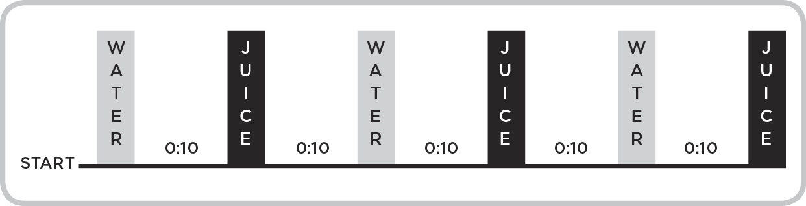
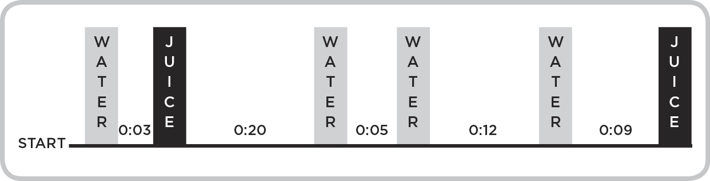
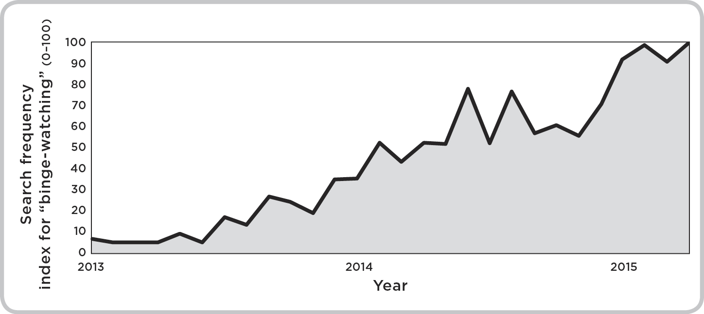
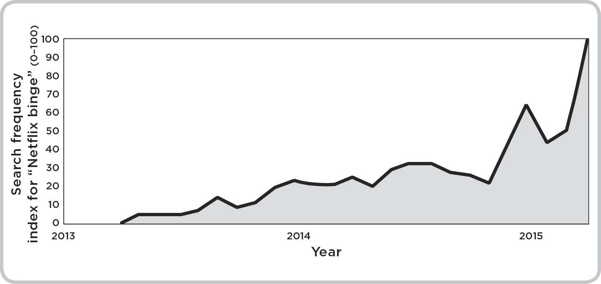

# 8. Cliffhangers

## 8.

## Cliffhangers

A minibus veers off a mountain road and teeters on the edge of a cliff. The minibus is an empty shell without seating. Inside are eleven thieves and their pile of stolen gold. The men hug the back wall as the gold slowly slides away from them, tipping the minibus toward oblivion. One of the men crawls slowly toward the gold. The only sounds are his shuffling, the creaking minibus, and the whistling of alpine winds. He moves within two feet of the gold, but the bus tips farther forward and it slides beyond his reach. Then, he rolls onto his back, faces his companions, and says calmly: “Hang on a minute, lads. I’ve got a great idea.” The story ends.

In the summer of 1969, thousands of cinemagoers enjoyed the first ninety-four minutes of *The Italian Job*, but many hated this, the final ninety-fifth minute. In their own words, the ending was “ridiculous,” “pretentious garbage,” “horrible,” “crap,” “frustrating,” “not funny,” “without morals,” “without heart,” “a turkey,” “like a soft drink that’s gone flat,” “enjoyable maybe if you’ve had a lobotomy.” It takes a special ending to inspire this sort of vitriol, and that ending turns out to have been no ending at all: a literal and metaphorical cliffhanger. The problem here was that viewers had committed an hour and a half to the story, and like all humans they were wired for closure. If you’ve ever been denied a joke’s punchline, you’ll know that it’s better to hear no story at all than to hear all but the story’s final beat.

—

Forty years earlier, a Lithuanian psychologist named Bluma Zeigarnik stumbled on the power of cliffhangers. She was sipping coffee at a small café in Vienna when she noticed that her waiter remembered his customers’ orders with superhuman clarity. When he approached the kitchen, he knew to tell the cook to prepare eggs Benedict for table seven, a ham and cheese omelet for table twelve, and scrambled eggs for table fifteen. But as soon as those orders landed at tables seven, twelve, and fifteen, his memories of them vanished. Each order presented the waiter with a miniature cliffhanger that was resolved when the right meal reached the right customer. Zeigarnik’s waiter remembered his open orders because they wouldn’t leave him in peace—they nagged at him in the same way that the teetering bus nagged at *The Italian Job*’s frustrated viewers. When the waiter served each order, the cliffhangers were resolved, and his mind was free to focus on the new cliffhanger presented by his next order.

Zeigarnik designed an experiment to uncover the effect more carefully, inviting a group of adults into her lab to work on twenty different brief tasks. Some of these were manual, like creating clay figurines and building boxes, and others were mental, like arithmetic sums and puzzles. Zeigarnik allowed her participants to complete some of the tasks, but she interrupted them before they could complete others, and forced them to move on to the next task. The subjects were loath to stop, and they sometimes objected quite strenuously. Some were even angry, which showed how much tension Zeigarnik introduced with her interruptions. At the end of the experiment, she asked them to remember as many of the tasks as they could.

The results were striking. Like the waiter in Vienna, her participants recalled about twice as many unfinished tasks as they did finished ones. At first, Zeigarnik wondered whether the unfinished tasks were more memorable because participants experienced a small “shock” when they were interrupted. But when she ran a similar experiment, again interrupting her participants as they completed some tasks but then allowing them to complete those tasks later, the effect vanished. It wasn’t interruption that made the tasks memorable, but rather the tension from not being able to complete them. In fact, the interrupted tasks that were later completed were no more memorable than the tasks completed without interruption. Zeigarnik summarized her results: “When the subject sets out to perform the operations required by one of these tasks there develops within him a quasi-need for completion of that task. This is like the occurrence of a tension system which tends towards resolution. Completing the task means resolving the tension system, or discharging the quasi-need. If a task is not completed, a state of tension remains and the quasi-need is unstilled.” So the Zeigarnik Effect was born: incomplete experiences occupy our minds far more than completed ones.

Once you look for it, the Zeigarnik Effect is everywhere. Take the case of earworms—catchy songs that stubbornly play over and over inside your head. Jeff Peretz, a guitarist and music professor at New York University, told me that some earworms achieve cult status because they plant cliffhangers that never resolve. He pointed to the colossal 1978 hit song “September,” by Earth, Wind & Fire, a combination of percussive bounce and brassy punch that begins with the line, “Do you remember the twenty-first night of September?” In 2014, as the song turned thirty-six, longtime band member Verdine White told an interviewer that, “People now are getting married on September 21st. The stock market goes up on September 21st. Every kid I know now that is in their 20s, they always thank me because they were born on September 21st. They say it’s one of the most popular songs in music history right now.”

This was the golden age of disco, and in many ways, “September” is a model disco classic. But in other ways it’s very unusual. Many pop hits follow a standard circular chord progression—they launch like a rocket ship, hover for a time above the launch pad, and ultimately close the melodic loop by returning to Earth. In the world of Bluma Zeigarnik’s waiter, these tracks are fulfilled orders: they’re satisfying, but your mind leaves them behind when they end, and another song begins.

Not so for “September,” according to Peretz*.* “One of the amazing things about the chord progression in ‘September’ is that it never lands. It makes this loop that you never want to stop hearing. And that’s why it’s so popular still, to this day. This same approach is used for the song’s main theme, its chorus, and its hook. It keeps going on and on. Without a doubt this contributes to its longevity. It has all the makings of an earworm. And this looped feature only makes it harder to leave once it does get stuck in your head.” Long after we’ve forgotten other songs, the endless loop continues to demand our attention. Almost forty years after its release, “September” remains a staple at parties and weddings. (By coincidence, my wife and I were married on the evening of September 21, 2013, and our D.J. was under strict instruction to include the song in his playlist.)

“September”’s cliffhangers never quite resolve, but some songs endure in our minds because they resolve their cliffhangers in unexpected ways. In the summer of 1997, Radiohead released their cult track “Karma Police,” which showcased the band’s musical sophistication. The song uses two subtly different versions of the same melody, and until you’ve listened to it many times, you have no idea which version you’re about to hear. There’s no rhyme or reason that guides you, and so, Peretz explains, it keeps you on your toes. “The song has you wondering which version of the loop you’re going to hear. It seems too sophisticated to be an accident, and I imagine when [lead singer] Thom Yorke was writing the song, he had in mind the idea of karma being a cyclical thing. He totally rung the bell with that one. It’s an iconic song. Stevie Wonder’s song “Evil” is similar. It has a sequence that starts out in C major, but when it brings you back around to where you started, you’re in a new place. It doesn’t bring you home.”

“September” runs for a gripping three minutes and thirty-five seconds, but it pales next to a category of addictive experiences that grip audiences for months at a time.

—

In October 2014, National Public Radio began broadcasting *Serial,* a twelve-part podcast that ran for two and a half months. A team of journalists led by NPR’s Sarah Koenig were investigating whether a Baltimore high school student named Adnan Syed had been wrongly convicted for his ex-girlfriend Hae Min Lee’s murder in 1999. Other podcasts had developed a following, but *Serial* was wildly and uniquely popular. (When I emailed Koenig for an interview, she very politely declined my request. “I’m afraid I just can’t,” she told me. “I’m sort of deluged at the moment.”) For three months, countless conversations included the question, “Have you heard about *Serial*?” I discussed the podcast with friends and strangers everywhere, and I wasn’t alone. A number of major publications wrote about *Serial*’s success, and many of their titles and opening paragraphs focused on the podcast’s addictiveness:

The host of this compelling, addictive nonfiction murder-mystery talks about the show’s origins and why it’s okay to “like” her interviewees.

—*Rolling Stone*

The thirteen stages of being addicted to “Serial.”

—*Entertainment Tonight*

“Serial”: The Highly Addictive Spinoff Podcast of “This American Life.”

—NBC News Online

Ira Glass and the folks behind *This* *American Life* radio recently launched “Serial,” an addictive podcast about a gruesome murder and the curious court case that convicted a 17-year-old kid. And it’s better than the best episode of *Law & Order* because it features the actual people who lived through the tragedy—plus, you have no clue how it’s going to end.

—Entertainment Weekly

This last quote nails *Serial*’s magic ingredient: Koenig and her team opened a Zeigarnik loop, but none of her listeners knew when (if ever) the loop would be closed. Would the true murderer be revealed in episode three? Episode nine? In the final episode? Never? Halfway through the series, Koenig admitted that she had no idea how the podcast would end. After a year of interviews and careful research, she and her team were no closer to resolving the only question that really mattered: who killed Hae Min Lee? The audience was rapt because the answer always seemed within reach. Many episodes included one or two interviews with Syed, the convicted murderer. He always seemed to be on the verge of saying something incriminating—or of saying something that would prove his innocence beyond doubt. And the same was true of countless other interviews. One of Syed’s acquaintances provided an alibi that seemed to place him at a library precisely when the murder was supposed to be occurring several miles away. But that lead broke down, and the loop remained open.

Thousands of listeners downloaded the final podcast on December 18, 2014, hoping for an answer. But none came. Koenig believed Syed was innocent, but she admitted she wasn’t completely sure. The show ended, but the cliffhanger remained, and the listeners refused to move on. They established vibrant online discussion groups. The guilty camp scolded the innocents for being naïve, and the innocents called the guilties jaded skeptics. Almost fifty thousand *Serial* fans shared their views on a *Serial* page (or subreddit) established on the Reddit website. The best evidence that their engagement rose above simple interest came on January 13, 2015. This was the sixteen-year anniversary of Hae Min Lee’s murder, and the subreddit’s moderators honored Lee by suspending the site for twenty-four hours. In its place was a short message:

On January 13, 1999 life would be changed forever.

Hae Min Lee was an extraordinary individual.

. . .

It was 16 years ago today that her life was ended tragically, and her family and friends’ lives would never be the same.

While Hae’s murder was the basis of the podcast *Serial*, let us never forget the tragedy itself.

Out of respect for Hae’s memory, this subreddit will fall silent for a day so that we can all reflect on the true injustice at the center of a heated debate.

Many users applauded the tribute, but others went into *Serial* withdrawal. A user named hanatheko admitted, “Wow, I am addicted . . . the past 24 hours were painful and I fell ill with depression.” For hanatheko, a day without the site was a day too long. Others felt the site’s moderators had no right to shutter the site for any reason at all. One user suggested these angry users were “acting like the Westboro Baptist Church of the fucking Internet right now.” Another named Muzorra pointed out that “all the commentary . . . that the victim always gets lost and becomes a point of data and little more . . . gets forgotten the moment someone makes it a little harder to get at their toy for a little while.” When the site went live again at midnight, hanatheko, Muzorra, and thousands of other users went back to attacking and defending Camp Guilty, Camp Innocent, and Camp Undecided.

NPR’s release of *Serial* heralded a flood of unsolved real-life crime documentaries. In February 2015, HBO released *The Jinx*, which tracks the life of Robert Durst, a man who was associated with a number of unsolved murders. The day before HBO released the documentary, Durst was arrested for one of those murders—fueled in part by some of writer Andrew Jarecki’s discoveries. Then, in December 2015, Netflix released a ten-part real-life murder documentary called *Making a Murderer.* The documentary’s filmmakers, Laura Ricciardi and Moira Demos, spent ten years tracking a man named Steven Avery, who had been convicted of murdering a young woman in small-town Wisconsin. *The Jinx* and *Making a Murderer* were just as addictive as *Serial*, and both attracted waves of acclaim and millions of viewers. All three programs are produced with skill—but much of their popularity is baked into their ambiguity. In *Slate*, Ruth Graham wrote about *Making a Murderer*:

“This is the perfect *Dateline* story,” a *Dateline* producer says of the Avery case in *Making a Murderer*. “It’s a story with a twist, it grabs people’s attention. . . . Right now, murder is hot.” . . . But if *Dateline* leaves viewers hanging over commercial breaks, the multiepisode format of shows like *Making a Murderer* dangles us over much deeper chasms. The series may be more prestige than pulp, but it delivers the same pleasure-pellets of any crime story: “That poor woman!” “Who really did it?” “Someone must pay!”

Take Episode 4 of *Making a Murderer*, which ends with a whopper of a plot bombshell . . . Cue my husband and I freaking out on the couch and agonizing over whether to stay up late to watch another episode. With a cliffhanger like that, how could we not?

As I write this, people are still feverish about *Serial* and *Making a Murderer.* (*The Jinx* has a devoted following, too, though it’s perhaps tempered in part by Durst’s arrest and the documentary’s more limited release.) The *Serial* and *Making a Murderer* subreddits continue to attract new posts each day. But if someone can prove Steven Avery’s innocence, or who murdered Hae Min Lee, the loops will close, and the subreddits will wither. A cliffhanger only lasts until you know whether the bus plunges, a waiter only remembers an order until the plate reaches his customer, and the fate of a mobster from suburban New Jersey remains interesting only as long as you don’t know whether he lives or dies.

—

When David Chase wrote the eighty-sixth and final episode of *The Sopranos*, he posed a question that he refused to answer: was Tony Soprano dead? For eight years New Jersey mob boss Tony Soprano evaded death while ninety-two of his enemies and friends faded away. They died from gunshot wounds and beatings and drowning and natural causes; from stabbings and heart attacks and strangulation and drug overdoses. Their deaths captivated viewers, but nowhere near as much as Tony’s purgatory absorbed them.

The scene is legend. On June 10, 2007, twelve million Americans watched as Tony Soprano and his family gathered at Holsten’s diner. A man in a brown leather jacket enters the restaurant, and sits at the counter. He glances back at the family, briefly, and heads for the restroom. In the show’s final seconds, a bell on the front door dings, Tony looks up toward the door, and the screen cuts to black. For eleven seconds it remains that way, eight years of action reduced to a profound quiet. Many viewers wondered whether their TVs or cable boxes had cut out at exactly the wrong moment, but this was Chase’s vision.

Fans of the show were perplexed, so they took to Google. The search engine hosted a flood of searches for “Sopranos final episode” beginning at 10:02 P.M. on the East Coast, which continued well into the night. In their desperate search for some kind of resolution, viewers hoped someone out there on the web was more sophisticated than they were. (Eight years later, *Serial* fans would do the same when they took to Reddit.) Media critics either loved the episode or hated it, and without fail saved most of their energy for its closing five minutes. What had happened? Why had Chase cut the story short?

Two competing theories surfaced. On the one hand, perhaps Chase was trying to suggest that life for Tony and his family would continue beyond the show’s end. Early in the final scene, Tony had popped a couple of coins in a small jukebox at his table, and Journey’s “Don’t Stop Believin’” began to play. The last thing viewers heard was singer Steve Perry launching into the song’s chorus, “Don’t stop . . . !” Chase refused to let Perry complete the phrase, and perhaps the two words that closed the show served as a message: the show had ended, but the lives it depicted wouldn’t stop.

On the other hand, many fans were convinced that the silent black screen signaled Tony’s death. Since Tony wasn’t alive to experience the world after his death, viewers were treated to the same abrupt end. His wife and kids would live to hear Steve Perry sing the final word in the song’s title, but it might be drowned out by the gunshot that ended Tony’s life. According to this theory, the man in the leather jacket was Tony’s assassin; in an homage to Tony’s favorite scene from *The Godfather*, perhaps the man had gone to the bathroom to retrieve a gun. If Chase were implying that Tony was dead, he couldn’t have chosen a more apt final word than “stop!”

TV journalists clamored for an answer, and Chase occasionally tossed a crumb or two in reply. He continues to lead them on, and refuses to offer a definitive interpretation. In his first interview after the show ended, he said, “I have no interest in explaining, defending, reinterpreting, or adding to what is there. No one was trying to be audacious, honest to God. We did what we thought we had to do. No one was trying to blow people’s minds, or thinking, ‘Wow, this’ll piss them off.’” Eight years and several interviews later, fans were still unsatisfied. In April 2015 Chase told a writer that, “It was very simple and much more on the nose than people think. Either it ends here for Tony or some other time. But in spite of that, it’s really worth it. So don’t stop believing.” In some interviews, he seemed confused by the question. “I saw some items in the press that said, ‘This was a huge fuck you to the audience.’ That we were shitting in the audience’s face. Why would we want to do that? Why would we entertain people for eight years only to give them the finger?”

*Serial* fans were more disappointed than angry, because Sarah Koenig wanted to know who killed Hae Min Lee as badly as they did. She was on their team. But Chase was an antagonist, willfully denying his viewers an answer to the most important question he’d posed in eight years. The *Chicago Tribune*’s Maureen Ryan spearheaded the “pissed off” camp in her column titled, “Are you kidding me? That was the ending of ‘The Sopranos’?” She told her readers, “You can call the ending sadistic. You can call it an ending that leaves room for a sequel. Either way, it’ll have fans talking for months.” One commenter named Ryan agreed. “The finale sucked! The final shot ruined the entire episode for me. We were robbed . . . ROBBED, I tell you!” And yet, for all their anger, nearly a decade on people can’t stop talking about the show’s final episode. It’s as though they’ve taken the show’s final two words from Steve Perry too seriously: “Don’t stop!”

—

Which of the following steps in the chain below would you expect to make people happiest?

Step 1: Desiring something (food, sleep, sex, etc.).

Step 2: Wondering whether that desire will be satisfied.

Step 3: Having the desire satisfied.

. . . Repeat for the next desire.

Step 3 is the obvious answer. It’s the step that frustrated fans when *The Italian Job*, *Serial*, and *The Sopranos* ended without resolution, and it’s the reason we bother with steps 1 and 2 at all. But, in 2001, Greg Berns and three neuroscientist colleagues undertook a study that asked twenty-five adults to put a small tube in their mouths as they lay on their backs in an fMRI machine. The machine scanned their brains for evidence of pleasure as an experimenter fed them drops of water and fruit juice through the tube. Most of the adults preferred juice to water, but the human brain treats both juice and water as small rewards. For half of the experiment, the drops came in predictably, every ten seconds, alternating between water and juice:

Then, during the other half, the experimenters introduced the element of surprise. Now the adults had no idea when they’d receive their next reward, or whether it would be juice or water:

If satisfaction were all that matters, participants’ brains would have fired identically in both halves of the experiment—or perhaps more vigorously in the predictable half, when they could anticipate and savor the coming reward. But that’s not what happened. Predictability is pleasing at first, but it loses its luster. Near the end of the predictable half of the experiment, participants’ brains began responding more and more weakly.

Not so during the unpredictable run, which hooked participants in the same way that *Serial* hooked its listeners. When the rewards were unpredictable, participants enjoyed them that much more—and continued to enjoy them through to the end of the experiment. Each new reward followed its own micro-cliffhanger, and the thrill of waiting made the entire experience more pleasurable for a longer period of time.

These same micro-cliffhangers drive the thrill of compulsive shopping. In 2007, a team of entrepreneurs introduced a remarkably addictive online shopping experience called Gilt. Gilt’s website and app promote flash sales that last between one and two days each. Sales are available only to members*,* and they feature well-priced designer clothes and home goods. The platform is booming, with six million members, so its merchandisers can purchase huge quantities of heavily discounted high-end products. Even after the site tacks on a small margin per item, members pay far less than retail prices.

New sales arrive without warning, so members constantly refresh their pages. Each newly loaded page produces a micro-cliffhanger. For many of Gilt’s members, the site offers a low-grade thrill amid their otherwise predictable lives. You can see this in the spike of lunchtime traffic between noon and one every afternoon, during which the site sometimes draws in more than a million dollars in revenue.

Darleen Meier, who runs a lifestyle blog called *Darling Darleen*, was excited when her membership was approved in October 2010. (She was on a wait list for several weeks beforehand.) Meier treated her readers to a front-row seat, celebrating her membership and then sharing some of her favorite purchases. But, just two months later, Meier was moved to publish a post titled “Gilt Addict.” The problem became clear when she barely resisted buying a well-priced Vespa scooter. (She suppressed the impulse after imagining how her husband would respond when he saw the scooter.) Meier’s relationship with Gilt intensified when a chime began alerting her when a new deal had landed on the site. Regardless of what she was doing, she’d stop to check the app. Sometimes, she found herself pulling off the road while running an errand or driving to pick up her young son from school. Sometimes the cliffhanger didn’t resolve in Meier’s favor—some of the deals didn’t appeal to her—but often, by the time the car was moving again, she’d spent hundreds or even thousands of dollars. At the height of her Gilt addiction, new boxes were landing on her doorstep every day.

Meier wasn’t alone. Online message boards were full of shopping addicts searching for help. On PurseForum, a social network for avid shoppers, Cassandra22007 admitted to being addicted to Gilt, and to other so-called flash sale websites:

It’s become painfully clear to me that I have a problem with Gilt Group and I need an intervention! I’m thinking about banning myself from this site at least temporarily. Basically, I’m unemployed right now and I really have no excuse for buying new clothes and stuff that I probably won’t wear until I’m employed again. I currently have like 6-10 items I’ve gotten there that I have not actually worn/used yet, and I just ordered like 5 more things today.

What’s striking about Cassandra22007’s behavior is that she wasn’t buying clothes because she needed them. Just as Greg Berns had shown with his juice experiment, it wasn’t so much the reward itself that mattered, but rather the thrill of the chase. Gilt didn’t provide shoppers like Meier and Cassandra22007 with products they couldn’t get elsewhere—it provided them with a string of micro-cliffhangers that made the act of hunting down those products deeply addictive.

This shopping produces a lot of clutter, and there’s now a cottage industry of self-styled home organization gurus. The latest is Marie Kondo, a Japanese “cleaning consultant.” Kondo practices a method that she calls KonMari: throwing out everything in your home that doesn’t “spark joy.” Kondo explained the principles of KonMari in *The Life-Changing Magic of Tidying Up*, which she first published in 2011. The book has been translated into dozens of languages, and has sold more than two million copies worldwide. Kondo has since published a companion volume, *Spark Joy*, which is also a major bestseller. Tidying up isn’t easy, because it goes against the human instinct to retain value. We hate throwing something out if it might provide future value, and it’s hard to know for sure that once-useful possessions won’t be useful again. But KonMari has one tremendous asset: tidying up is a sort of open loop that demands closing. We hate to throw things out, but we also hate clutter. The people who shop obsessively become the same people who tidy obsessively, and the process becomes a self-perpetuating loop. Once you know to look, you start seeing loops like this one everywhere.

—

In August 2012, Netflix introduced a subtle new feature called “post-play.” With post-play, a thirteen-episode season of *Breaking Bad* became a single, thirteen-hour film. As one episode ended, the Netflix player automatically loaded the next one, which began playing five seconds later. If the previous episode left you with a cliffhanger, all you had to do was sit still as the next episode began and the cliffhanger resolved itself. Before August 2012 you had to decide to watch the next episode; now you had to decide to *not* watch the next episode.

At first this sounds like a trivial change, but the difference turns out to be enormous. The best evidence of this difference comes from a famous study on organ donation rates. When young adults begin driving, they’re asked to decide whether to become organ donors. Psychologists Eric Johnson and Dan Goldstein noticed that organ donation rates in Europe varied dramatically from country to country. Even countries with overlapping cultures differed. In Denmark the donation rate was 4 percent; in Sweden it was 86 percent. In Germany the rate was 12 percent; in Austria it was nearly 100 percent. In the Netherlands, 28 percent were donors, while in Belgium the rate was 98 percent. Not even a huge educational campaign in the Netherlands managed to raise the donation rate. So if culture and education weren’t responsible, why were some countries more willing to donate than others?

The answer had everything to do with a simple tweak in wording. Some countries asked drivers to opt in by checking a box:

If you are willing to donate your organs, please check this box: 

Checking a box doesn’t seem like a major hurdle, but even small hurdles loom large when people are trying to decide how their organs should be used when they die. That’s not the sort of question we know how to answer without help, so many of us take the path of least resistance by not checking the box, and moving on with our lives. That’s exactly how countries like Denmark, Germany, and the Netherlands asked the question—and they all had very low donation rates.

Countries like Sweden, Austria, and Belgium have for many years asked young drivers to opt out of donating their organs by checking a box:

If you are NOT willing to donate your organs, please check this box: 

The only difference here is that people are donors by default. They have to actively check a box to remove themselves from the donor list. It’s still a big decision, and people still routinely prefer not to check the box. But this explains why some countries enjoy donation rates of 99 percent, while others lag far behind with donation rates of just 4 percent. After August 2012, Netflix viewers had to opt out of watching another episode. Many chose to do nothing and, slack-jawed, they began their eighth consecutive episode of *Breaking Bad*.

Netflix subscribers had been binge-watching since the company introduced streaming in 2008, but bingeing has been escalating since then. Google Trends, which measures the frequency of Google searches across time, shows the frequency of searches for “binge-watching” between January 2013 (when people first begin searching for a term) and April 2015 in the United States:

And this one shows the frequency of searches for “Netflix binge” for the same time period in the United States:

Search term popularity is an indirect measure, but Netflix conducted its own research in November 2013. The company employed a market research firm to interview over three thousand American adults. Sixty-one percent of these people reported some degree of binge-watching, which most respondents defined as “watching between two and six episodes of a TV show in one sitting.” Netflix found similar patterns in viewing data, which it collected from 190 countries between October 2015 and May 2016. Most people who binge complete the first season of the shows they’re watching in four to six days. A season once stretched on for months at a time, but now it’s consumed in under a week, at an average of two to two and a half hours a day. Some viewers report that binge-watching improves the viewing experience, but many others believe that Netflix—and post-play in particular—has made it very difficult to stop watching just one episode at a time. Much of this rise, charted in the Google Trends graphs, reflects the effectiveness of cliffhangers, and the absence of barriers between the end of one episode and the beginning of the next.

When Willa Paskin, *Slate*’s television critic, reviewed a show called *Love*, she explained that even mediocre TV shows become addictive with “an assist” from binge-viewing. *Love* was a Netflix production, released in a single batch of ten episodes:

The show gets an assist from binge-watching itself—a style of viewing that encourages audiences to invest in the characters as people, regardless of how little artistry surrounds them. It’s like being told a story, any story: At a certain point, you just want to know what happens next. If *Love* aired every week, you could take it or leave it. But Netflix makes it so easy to watch three episodes in one sitting that it’s tempting to keep plowing forward on the force of curiosity alone—just how are these crazy kids going to get together? Binge-watching provides a show without much plot all the necessary momentum. By the time you stop hurtling forward, you’ve already seen it all.

—

Bluma Zeigarnik, the psychologist we met earlier in this chapter, lived a long and remarkable life littered with cliffhangers. In 1940, her husband Albert was sentenced to ten years in a Soviet prison camp on the charge of spying for Germany. Zeigarnik was left to wonder where he was and when he might come home. When the Soviet authorities captured Albert, they left behind a document that explains why we know so little about Zeigarnik’s life. That document, which her grandson stumbled on many decades later, states that the authorities had seized “the contents of a sealed room with numerous documents, folders, notebooks, and records.”

Zeigarnik’s career took off eventually, but her academic life was just as turbulent as her personal life. She was forced to write three doctoral dissertations after the Soviet authorities refused to recognize her first dissertation, and her second was stolen. She had copies of the second dissertation, but was forced to destroy them when she feared that the thief might publish her work and accuse her of plagiarism. For almost thirty years, Zeigarnik wandered in academic purgatory before completing her third dissertation and joining Moscow State University as a psychology professor in 1965. She was elected chair of the department two years later, and held that position for the next two decades, until her death. With mountainous talent and dogged determination, Zeigarnik ensured that the cliffhanger ultimately resolved in her favor.
