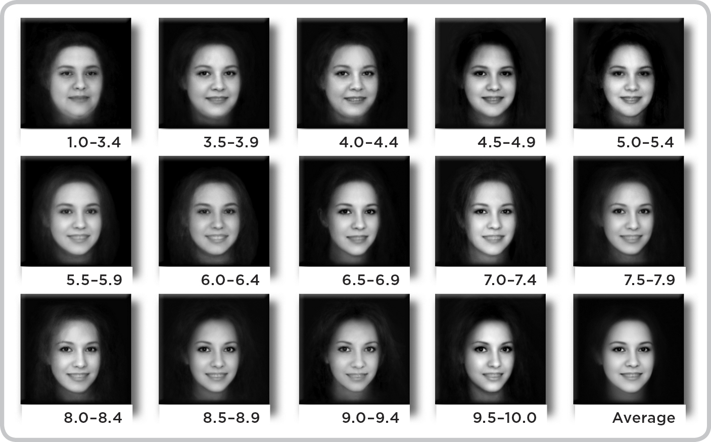

# 9. Social Interaction

## 9.

## Social Interaction

In December 2009, best friends Lucas Buick and Ryan Dorshorst began selling an iPhone app. The app sold for $1.99, and the pair watched eagerly as the download counter climbed. Thirty-six hours after its launch it was the most downloaded app in Japan. Sales rose more slowly in the U.S. but by New Year’s Day U.S. customers had downloaded over 150,000 copies of the app. Apple itself took notice, and soon the app was front-and-center on the Apple Store’s homepage.

The app was called Hipstamatic, and it allowed iPhone users to digitally manipulate the photos they took with the camera built into their phones. With the help of digital film, flashes, and lenses, even naïve photographers could turn mundane shots into masterpieces that mimicked the retro snaps of the 1980s. Experts were paying attention, too. Damon Winter, a *New York Times* photographer*,* used the app to take shots of soldiers in Afghanistan in 2010. The photos won Winter third place in the Pictures of the Year International photojournalism competition, and further enriched the Hipstamatic brand.

Buick and Dorshorst were graphic designers by trade, but they also happened to be intuitive entrepreneurs. To cultivate the app’s retro appeal, they used names like *Ina’s 1982 Film*, *Roboto Glitter Lens*, and *Dreampop Flash.* Their masterstroke was inventing a rich backstory for the app that journalists have since struggled to authenticate. As they told it, in 1982 two brothers from Wisconsin created a camera named the *Hipstamatic 100.* Their aim was to build a camera that was cheaper than its film, and though they succeeded, they managed to sell only 154 units. The brothers died in a tragic car accident in 1984, and their older brother, Richard Dorbowski, kept the three remaining Hipstamatic 100s in his garage until July 29, 2009, when Buick and Dorshorst told him they wanted to release a digital version of the camera.

Journalists were captivated by the story, and they described Hipstamatic’s romantic history in dozens of feature stories. They were helped by scattered online evidence to support the story: a blog page on the Hipstamatic 100 written by Dorbowski (with photos of his younger brothers in the early 1980s), and Facebook and LinkedIn pages that described Dorbowski as living in Wisconsin and working as chief comptroller at a paper company. It wasn’t until several years later, when other journalists tried to delve deeper, that the backstory crumbled. The three brothers were a figment, and so, apparently, was the Hipstamatic 100. Still, the Hipstamatic app was real, and hundreds of thousands of copies were selling every month. Apple crowned Hipstamatic “2010’s App of the Year,” and the *New York Times* included the app in its “Top Ten Must-Have Apps for the iPhone” list in November 2010.

Buick and Dorshorst were riding high, but a pair of entrepreneurs living in San Francisco were preparing to release a rival app. Kevin Systrom and Mike Krieger launched Instagram in October 2010. The two apps offered the same basic service, so entering the market ten months late put Instagram at a huge disadvantage. Though Instagram lacked Hipstamatic’s charming backstory—its name simply combined the words “instant” and “telegram”—Systrom and Krieger were canny businessmen. If 2010 was the year of Hipstamatic, 2011 was the year of Instagram. Hipstamatic remained popular, but its download count slowed, and Instagram soon had a larger base of users. Having crowned Hipstamatic “App of the Year” in 2010, Apple bestowed the same honor on Instagram in 2011. In 2012, Hipstamatic’s user count peaked around five million, and Instagram now has around three hundred million users. But the biggest difference between the apps came on April 9, 2012, when Facebook acquired Instagram for one billion dollars. When Dorshorst read about the acquisition, he was convinced he was reading a headline from satirical newspaper *The Onion.* He had to double-check. Laura Polkus, a former designer at Hipstamatic, remembered, “We saw Mark [Zuckerberg]’s blog post, and it was like, “Wait, one billion? Like, a billion dollars? What does that mean for us? Does that mean Instagram won?”

Hipstamatic and Instagram offered the same core features, so why did Hipstamatic falter while Instagram continues to grow? The answer lies in two critical decisions that Systrom and Krieger made before they released the app. The first was to make the app free to download. That got users in the door, and it explains in part why so many users downloaded the app early on: there was no risk of spending on a dud, so at worst they could delete the app a couple of days later. But many apps are free, and they still fail miserably. It was the pair’s second decision that made the difference: Instagram users posted their photos on a dedicated social network tied to the app. (Hipstamatic users could upload their photos on Facebook, for example, but Hipstamatic wasn’t itself a stand-alone social network.)

It’s easy to see why Zuckerberg chose to acquire Instagram. He and Systrom shared a similar insight: that people are endlessly driven to compare themselves to others. We take photos to capture memories that we’ll revisit privately, but primarily to share those memories with others. In the 1980s, that meant inviting friends over to watch slides of your recent vacation, but today that means uploading photos of your vacation in real time. What makes Facebook and Instagram so addictive is that every activity you post either does—or doesn’t—attract *likes*, *regrams*, and comments. If one photo turns out to be a dud, there’s always next time. It’s endlessly renewable because it’s as unpredictable as people’s lives are themselves.

So what is it about Instagram’s social feedback mechanism that makes it so addictive?

—

People are never really sure of their own self-worth, which can’t be measured like weight, or height, or income. Some people obsess over social feedback more than others do, but we’re social beings who can’t ever completely ignore what other people think of us. And more than anything, inconsistent feedback drives us nuts.

Instagram is a font of inconsistent feedback. One of your photos might attract a hundred likes and twenty positive comments, while another posted ten minutes later attracts thirty likes and no comments at all. People clearly value one photo more than the other, but what does that mean? Are you “worth” a hundred likes, thirty likes, or a different number altogether? Social psychologists have shown that we adopt positive ideas about ourselves more readily than we adopt negative ideas. To see how this works, answer the following questions quickly, without giving them too much thought:

|  |  |  |  |
| --- | --- | --- | --- |
| Below you’ll see a list of personality traits.  Please estimate the percentage of people in your town who embody less of each trait than you do: | | | |
| sensitive | sophisticated | ingenious | disciplined |
| neurotic | impractical | submissive | compulsive |

These are all ambiguous traits so it’s hard to know how much of them you or anyone else really possesses. Note also that some of them are positive (the ones on the top row), while others are negative (the ones on the bottom row). When students at Cornell University answered the same questions relative to their Cornell peers, they said they expressed more of the positive traits than 64 percent of other Cornell students, but more of the negative traits than only 38 percent of Cornell students. This rosy view captures how we generally see ourselves—and perhaps it means that we’ll pay close attention to the positive feedback and ignore the negative feedback we get on Instagram.

But as much as we value ourselves, we’re also very sensitive to negative feedback. Psychologists call this the “bad is stronger than good” principle, and it’s very consistent across different experiences. If you’re like most people, your instinct is to scroll to the negative reviews on Amazon, TripAdvisor, and Yelp, because nothing cements an opinion like sharp criticism. You’re also more likely to remember bad events from your past, and to ruminate over old arguments longer than you bask in recent praise. Even people who had happy childhoods, when asked to recall their lives as kids, are more likely to remember the few memories that were bad rather than the many that were good.

There are so many photos on Instagram that you might expect users to shrug off negative feedback. People should pay less attention to the “likes” under one Instagram photo than to the photos displayed at a solo art show or passed around to friends. In truth, though, the spotlight seems to find us even when we’re in a crowd. In 2000, a group of psychologists asked college students to walk into a room filled with other students while wearing a T-shirt featuring a photo of Barry Manilow. (An unnecessary pre-test confirmed that college students prefer not to wear a Barry Manilow shirt in public.) After a few minutes, an experimenter escorted the unlucky subjects from the room, and asked them to guess how many of their fellow students noticed the Barry Manilow shirt. Of course they had been preoccupied by the shirt the entire time, so they guessed that half the students in the room would recall the shirt; in truth, only one in five remembered seeing Barry Manilow’s likeness. A dud photo that attracts only three likes on Instagram is a bit like a Barry Manilow shirt. It’s embarrassing to its owner, who assumes that other users are staring and laughing, when in fact they’re far more concerned with their own photos, or at least with the endless line of photos that come before and after the “Manilow” shot.

The sting of negative feedback is so potent that many users take hundreds of shots before posting. Apps like Facetune allow tech novices to airbrush away their flaws for “perfect skin; a perfect smile,” the ability to reshape their faces and bodies, remove blemishes, and recolor gray hair. Essena O’Neill, a young Australian model, had half a million followers when she decided to reveal the truth behind her glamorous Instagram posts. O’Neill changed her account name to *Social Media Is Not Real Life*, deleted thousands of old photos, and edited the captions under others. One photo featured O’Neill on the beach in a bikini:

NOT REAL LIFE—took over 100 in similar poses trying to make my stomach look good. Would have hardly eaten that day. Would have yelled at my sister to keep taking them until I was somewhat proud of this. Yep so totally #goals.

Under another shot of O’Neill in a formal dress by a lake:

NOT REAL LIFE—I didn’t pay for the dress, took countless photos trying to look hot for Instagram, the formal made me feel incredibly alone.

And a third “candid” shot of O’Neill wearing a bikini:

Edit real caption: This is what I like to call a perfectly contrived candid shot. Nothing is candid about this. While yes going for a morning jog and ocean swim before school was fun, I felt the strong desire to pose with my thighs just apart #thighgap boobs pushed up #vsdoublepaddingtop and face away because obviously my body is my most likeable asset. Like this photo for my efforts to convince you that I’m really really hot #celebrityconstruct.

O’Neill attracted some backlash. Former friends accused her of “100 percent self-promotion,” and others called her new campaign “a hoax.” But tens of thousands of others praised her publicly. “Read her captions—this girl is a boss,” said one. “Aah, so good, love what she’s doing,” said another. O’Neill was voicing publicly what thousands of Instagram users felt across the globe: that the pressure to present perfection with every shot is relentless and, for many people, unbearable. In her last post, O’Neill wrote, “I’ve spent the majority of my teenage life being addicted to social media, social approval, social status, and my physical appearance. Social media is contrived images and edited clips ranked against each other. It’s a system based on social approval, likes, validation, in views, success in followers. It’s perfectly orchestrated self-absorbed judgment.”

—

In October 2000, Jim Young told his friend James Hong that he’d met a girl at a party. According to Young, the girl was “a perfect ten.” Young and Hong had grown up together, attended high school and then Stanford together, and now Young’s comment inspired them to design a website together. “This was on a Monday,” remembers Hong. “It wasn’t meant to be a serious project. We were just fooling around. Jim sent something to me on Friday or Saturday, I played with it over the weekend, and then we launched it the following Monday. So it was about a week from the idea to launching something.”

The site was the online embodiment of Young and Hong’s conversation. At 2 P.M. on the day of the launch, they asked forty-two of their friends to visit a webpage featuring Hong’s headshot and a rating scale from 1 to 10. “Be nice,” Hong told his friends, who were asked to decide whether Hong was “hot or not.” The site was that simple: visitors rated one headshot after another, from 1 (not) to 10 (hot). After each rating, the screen refreshed to include the same headshot’s average rating on the site. That way they learned instantly whether their internal beauty scale matched the scale used by other people. Forty thousand people visited the site the day after it launched. Eight days later, it was attracting two million hits a day—all without help from Facebook, YouTube, Twitter, and Instagram, which weren’t due online for another several years. Visitors weren’t just rating photos; they were also uploading their own, curious to know whether the online universe considered them hot—or not.

The site, which Hong and Young called Hot or Not, wasn’t just viral; it was also addictive. And it wasn’t just addictive to the usual crop of adolescent males. “I was looking at the site, and my dad walked into the room,” Hong recalled. “You have to understand that at this point I was supposed to be getting a job, so I just told him, ‘Oh, that’s something Jim’s working on.’” Hong’s dad was curious, so Hong showed him how the site worked. After a quick demonstration, Hong’s dad took the mouse and began rating. Hong remembers, “It was bizarre, because the first person I ever saw get addicted to rating people on whether they were hot or not was my dad. You have to understand, my dad is this sixty-year-old Asian engineering PhD guy who, as far as I was concerned, was asexual—except when he had me, my brother, and my sister.” Hong’s dad wasn’t alone; millions of users were spending long stretches of time on the site, even willing to wait thirty seconds between pictures, which were painfully slow to download for the first few months.

Hong and Young created the site on a lark, but online advertisers began approaching them with serious offers. The friends stood to earn thousands of dollars a day, but for one catch: some of the photos were pornographic, and the advertisers were only willing to work with sites that promised to sanitize their content. Hong’s parents had just retired, so he awkwardly asked them to trawl the site for porn. They had both developed low-level addictions to Hot or Not, so they happily obliged. If nothing else, their son had given them an excuse to spend more time on the site. At first they kept up with most of the site’s new content. “Hey, it’s going well! It’s fun to look at people,” Hong’s dad reported gamely. When Hong’s dad began sharing some of the banned photos with his son, Hong decided that he needed to find some new raters. He couldn’t bear to imagine his parents looking at porn all day.

Hong and Young had no trouble enlisting some of their users as moderators. Like Hong’s parents, they were glad to have a reason to spend hours a day browsing the site. In time, Hot or Not morphed into a dating website—a precursor to Tinder and other online dating platforms that prioritized looks over personality. Users paid just six dollars to join the site—a number that Hong and Young chose because it matched the price of two beers in a bar in the Midwest. At its peak, the site was generating $4 million in revenue each year, of which 93 percent was profit. The overhead for their lean, unintentionally addictive start-up was incredibly low. Rumor had it that Hong and Young’s early success inspired Mark Zuckerberg to create FaceMash, the face-rating site that paved the way for Facebook. In 2008 the pair sold the site for $20 million to a Russian tycoon who specialized in online dating websites.

When they designed Hot or Not, James Hong and Jim Young were smart to include the same feature that made Instagram so successful: an engine for social feedback. After each rating, users discovered how closely their impressions matched the impressions of thousands of other users. Sometimes they matched and sometimes they didn’t, and both outcomes satisfied basic human motives: the need for social confirmation when they matched, and the need for individuality when they didn’t. (Of course it didn’t hurt that users were rating facial attractiveness rather than, say, the attractiveness of different landscapes. With our inbuilt drive to scan the horizon for potential mates and competitors, we’re naturally interested in physical attractiveness.)

Social confirmation, or seeing the world as others see it, is a marker that you belong to a group of like-minded people. In evolutionary terms, group members tended to survive while loners were picked off, one by one, so discovering that you’re a lot like other people is deeply reassuring. When people are deprived of these bonds, they experience a form of pain so severe that it’s sometimes called “the social death penalty.” It’s also very long-lasting—just remembering a time when someone excluded you is enough to rekindle the same agony, and people often list cases of social exclusion among their darkest memories. Discovering that you see a face the same way as other people see it is a route to belonging; it confirms that other people share your version of reality. Social confirmation is brief, and we need fresh doses all the time. It was this desire for repeated confirmation that nudged Hot or Not’s users to rate “just one more photo” over and over again. One user who went by the handle Manitou2121 created a series of morphs averaging all the faces that received similar ratings. He shared the morphs with other users so they could see whether their views matched the views of the average Hot or Not user.

Occasional disagreement has its own benefits, though, because it serves to remind you that you’re not like everyone else. Psychologists call this perfect balance the level of “optimal distinctiveness,” and you tend to strike it when you agree with other people about most but not all things. Everyone strikes that balance differently but the beauty of Hot or Not was that it provided both forms of feedback. Hot or Not was the Instagram of photo-rating sites, but it could have just as easily gone the way of Hipstamatic had Hong and Young chosen to disable the feedback engine. Instead, it thrived as thousands of users were driven to discover whether their version of hot mirrored the version endorsed by everyone else.

—

Iwas just about to end my phone call with software engineer Ryan Petrie when he said, “It’s interesting because I thought we were going to discuss my addiction to video games.” Petrie grew up designing video games, so I’d called to ask him why some games are more addictive than others. I hadn’t considered the possibility that he might be addicted to the very games he was designing. “I was very addicted for about eighteen months, when I was in college,” Petrie told me. “I tried to spend all day, every day, online. I’d log in before class, between classes at the university library, and as soon as I got home after classes ended.” On average, Petrie spent six to eight hours a day playing games, and “good” days were lost entirely to gaming. He flunked his classes, and spent a semester on academic probation. On the brink of expulsion, Petrie willed himself to spend more time in class and less time playing games, and his habit became manageable again.

Petrie is an old-school game designer. As a kid in the early 1980s, he watched his brother spend a summer programming a text-based *Wheel of Fortune* clone on an Apple IIe. To young Ryan this was magic. “My brother showed me a printout of the code, and I couldn’t believe that this written incantation produced a video game. I asked him what each line did, over and over again, and soon I was making my own games.” He began with a text-based Indiana Jones game that spanned three virtual rooms. He remembers it as “terrible,” but soon he began to improve. EA Sports hired him after college, and more recently he’s also spent time at Google and Microsoft.

“Have you heard of a MUD?” Petrie asked me. “A multiuser dungeon?” I hadn’t, and based on its name I wasn’t sure I wanted to know more. Petrie had been addicted to a MUD during college. MUDs are simple text-based role-playing games in which players type commands into the computer and watch as the screen refreshes with feedback and further instructions. Traditional MUDs feature scrolling text and no graphics, so they’re capable of updating quickly even on very slow networks. They’re completely free of the flashy sound and graphics that typify most of today’s games, so all you’re left with are the words on the screen and your imagination. Petrie’s MUD of choice involved quests that he completed with other users from around the world. These users became his friends, and he felt guilty for abandoning them whenever he wasn’t online. It was this social component of the game that kept Petrie hooked.

There’s a certain purity to MUDs, because unlike modern games they don’t rely on glitz and charm. Petrie was hooked entirely by the sense that he was playing alongside other people. They may not have been in the room with him, but they all shared a common purpose. The MUD had a chat function, so players could commend each other on a job well done, or commiserate when they were defeated by powerful enemies. Petrie told me that MUDs still exist, but they’ve been swamped by big budget games—the showy Hollywood productions to his beloved indie masterpieces. “After all this time, that MUD is still the best game I’ve ever played. I always wanted to make one just like it, but after overcoming my addiction I questioned the morality of creating that sort of game.”

Petrie’s MUD was compelling, but it has nothing on today’s most addictive games: massively multiplayer online games (or MMOs), like World of Warcraft or League of Legends. MUDs lived on the fringe, attracting a relatively small and sophisticated group of computer aficionados. In contrast, one hundred million people have opened WoW accounts. MMOs are more sophisticated than MUDs, but if you strip away their impressive graphics and sound effects, you’re left with the same basic structure: a series of quests and remote interactions among gamers who become friends, relying on one another for support both within and beyond the game.

—

A couple of weeks after I spoke to Isaac Vaisberg, the former WoW addict I mentioned earlier, I visited reSTART’s facilities in Washington State. Vaisberg obviously derived a lot of pleasure from his online friendships, so it wasn’t clear to me why experts frowned on online interactions. Hilarie Cash, a clinical psychologist and cofounder of reSTART, explained that “there’s nothing wrong with making friends online, as long as you also make friends in the real world. If we’re good friends, and we’re sitting together, that interaction, that energetic exchange releases a whole bouquet of neurochemicals that keeps us each regulated emotionally and physiologically. And it’s our birthright as social animals to have lots of this sort of safe and caring interaction that keeps us regulated. We’re not meant to be isolated islands.” The addictive online friendships that attract young gamers are dangerous, not for what they provide, but for what they can’t provide: a chance to learn what it means to sit, face-to-face, as you maintain a conversation with another person. The staccato taps of a keyboard—and even remote webcam interactions—obey a very different rhythm, and convey information along a much narrower bandwidth. “Even the smell of another person, the consistent eye contact that comes from being in the same room, is important,” Cash said. She also reminded me that people who communicate by webcam never seem to look one another in the eyes, because the other person’s eyes aren’t perfectly aligned with the webcam that conveys your gaze. “It’s a lot like feeding sugar to a hungry person,” Cash told me. “It’s pleasurable in the short-term, but eventually, they’ll starve.”

Cash invited me to participate in a group discussion session with the center’s inpatients. As the session began, she repeated a mantra that I’d heard a couple of times already: “Remember: once your cucumber brain has become pickled, it can never go back to being a cucumber.” The phrase was designed to discourage inpatients from doing what Vaisberg had done when he left the center: believing that they could play just one more game without their addictions returning. Cash was trying to explain that the inpatients’ brains were forever pickled, in a sense, and that their addictions were always on the cusp of being rekindled. The mantra was a cute way of saying something very confronting: that it’s impossible to ever completely escape the aftereffects of addiction. Cash also used the mantra to explain what happens when your brain is deprived of offline social interactions. As she told me, “If you only ever spend time online, a part of you withers away.”

Cash suggested I speak to Andy Doan, a neuroscientist who had studied learning and memory at Johns Hopkins. She told me Doan was an expert on gaming addiction who could tell me more about the downsides of interacting with people online. I called Doan as soon as I returned to New York. He works as an eye surgeon now, but he has studied and written about addiction extensively. He told me that addictive games have three critical elements: “The first part is immersion—the sense that you’re embedded in the game. The second is achievement—the sense that you’re achieving something. And the third—and by far the most important—is the social element.” Gaming addiction has risen dramatically, Doan said, because high-speed Internet connections have made it easier to communicate with other players in real time. Gone are the days of clunky networks and Ryan Petrie’s beloved, but peripheral, MUDs, which addicted a much smaller set of people. Now Isaac Vaisberg and tens of millions of other gamers can build simulated friendships that almost look and feel like the real thing.

Doan explained why a brain raised on online friendships can never fully adjust to interactions in the real world. In the 1950s and 1970s, in a famous series of experiments, vision researchers Colin Blakemore and Grahame Cooper showed that what a young kitten sees shapes how his brain works for the rest of his life. In one experiment, they confined the kittens to a very dark room until they were five months old. Once a day, they removed half the kittens from the room and placed them in a cylinder covered with horizontal black and white stripes. They removed the other half and placed them in a similar cylinder, this one covered with vertical black and white stripes. So, half the kittens saw only vertical lines, and half saw only horizontal lines. They explained that, for each kitten, “There were no corners to its environment, and the upper and lower limits to its world were a long way away. It could not even see its own body, for it wore a wide black collar that restricted its visual field.” They added, providing little comfort to anyone even remotely concerned with animal welfare, that “The kittens did not seem upset by the monotony of their surroundings and they sat for long periods inspecting the walls of the tube.”

When Blakemore and Cooper allowed the kittens to roam a normal room, they were very confused. All of them, regardless of whether they’d been exposed to horizontal or vertical lines, struggled to judge how far away they were from physical objects. They bumped into table legs, failed to jump back when the experimenter acted like he was about to tap their faces, and couldn’t follow moving objects unless they made a noise. (If you’ve seen how avidly cats follow laser pointers, you know how strange it is when a cat ignores a rolling ball.) When Blakemore and Cooper examined the kittens’ brains for activity, they found that the kittens reared in vertical environments showed no activity at all in response to horizontal lines, while those reared in horizontal environments did not respond to vertical lines. Their brains were effectively blind to whatever they hadn’t been exposed to naturally during the first few months of their lives. This, Andy Doan told me, was irreversible. The visual cortex inside these poor kittens’ heads had been pickled forever, and even exposing them to normal environments for the rest of their lives did nothing to reverse many of the effects of their stunted early lives.

Doan drew an analogy to Hilarie Cash’s reSTART inpatients. The technical term for what Blakemore and Cooper induced in their kittens is visual amblyopia (Greek for “blunt vision”). Doan told me that children reared on the Internet suffer a kind of emotional amblyopia. Children develop different mental skills at different ages, during so-called critical periods. They pick up new languages with ease until ages four or five, after which they only pick up new languages with considerable effort. A similar idea holds for developing social skills—and for learning how to navigate the complex world of teenage sexuality. If kids miss out on the chance to interact face-to-face, there’s a fair chance they’ll never acquire those skills.

Cash has seen dozens of adolescents, mainly boys but also girls, who have no problem interacting with peers online, but can’t carry a conversation with someone sitting across from them. The problem worsens when you encourage adolescent males and females to interact. “How do you learn to talk and flirt and date and end up in bed if you’ve only mixed with other people online?” Cash asked. “Our guys get sidetracked, and they develop intimacy disorders. They don’t have the skills to bring sexuality and intimacy together. Many of them turn to pornography instead of forming real relationships, and they never seem to understand true intimacy.” Cash referred to “our guys” because the center no longer admits women. “For four years we admitted women, but we had to revise our policy after a number of patients ignored the ‘no physical intimacy’ rule. We had many more male applicants in those days, so we decided to stop taking women. Now, with the rise of non-violent casual and social gaming, there are almost as many female applicants. We may have to reconsider our policy.”

Even addicts who, like Isaac Vaisberg, somehow win the charisma lottery are susceptible to a range of psychological and social disorders. One study found that gamers aged between ten and fifteen years who played more than three hours per day were less satisfied with their lives, less likely to feel empathy toward other people, and less likely to know how to deal with their emotions appropriately. Three hours may sound like a lot, but recent surveys have shown that kids spend an average of five to seven hours in front of screens each day. When today’s Millennials become adults, there’s a fair chance their social cucumber brains will be pickled.
